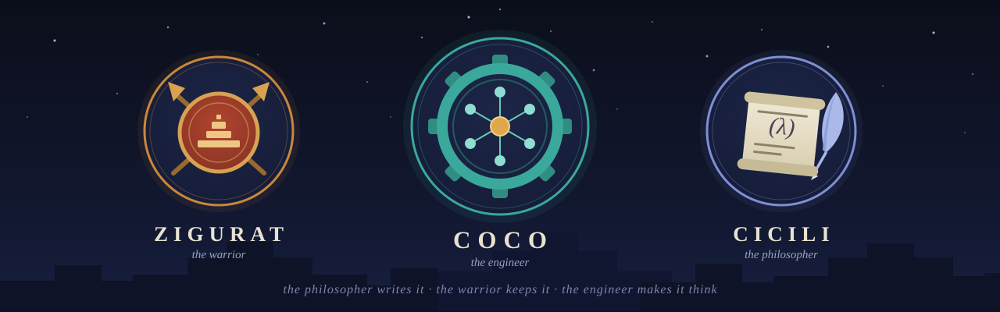

# cocolog



**A Prolog interpreter whose running state is data, so it can be suspended into
a database and finished by a different process.**

cocolog is written in [Cicili](https://github.com/saman-pasha/cicili) and keeps
its knowledge base in [ZiguratIP](https://github.com/saman-pasha/ziguratip).
It uses both and modifies neither.

```console
$ cocolog --kb demo forget                       # consult ADDS; it does not replace
forgot 0 clause(s) in 'demo'

$ cocolog --kb demo consult demo/family.pl
consulted 12 clause(s) into 'demo'

$ cocolog --kb demo start job "ancestor(tom,X)"
started 'job'

$ cocolog --kb demo --steps 12 step job          # one process
  1. ancestor(tom,bob)
  2. ancestor(tom,liz)
job: suspended at 13 inference(s), 2 answer(s) this turn

$ cocolog --kb demo --steps 12 step job          # a different process
  1. ancestor(tom,ann)
  2. ancestor(tom,pat)
job: suspended at 26 inference(s), 2 answer(s) this turn
```

Between those two commands the machine was not in memory anywhere. It was three
hundred bytes of ASCII in a table.

## The one decision everything follows from

A term is an **index into a flat array of 64-bit cells**, not a pointer into a
graph, and the resolution engine **never recurses in C**: the continuation is a
term on the heap and the choice points are an array of integers.

Written the natural way — malloc'd term nodes, a recursive `solve()` that uses
the C stack as its continuation — an interpreter is half the length. But its
state is then pointers and stack frames, and neither is data. cocolog exists to
stop mid-proof and go into a database, so:

| | |
|---|---|
| terms are indices | an array of indices is position independent: write it out, read it back at a different address, and every reference still means what it meant |
| the continuation is a term | `'$k'(Goal, Barrier, Rest)` on the heap, so a pending goal is a cell like any other |
| a cut barrier travels per goal | a suspended machine has to remember the barrier of *every* pending goal, not just the current one |
| choice points are integer frames | `{kind, goals, trail_mark, heap_mark, call, pred, clause_ix, barrier}` and nothing else |

`lib/state.cicili` is what that buys: freezing a machine is printing six arrays
and thawing one is reading them back. There is no graph walker, no pointer
fixup and no stack to reconstruct — and there could not be one, because a C
stack is not something you can write to a table.

## Layout

```
lib/term.cicili        cells, the machine, interning, unification with a
                       trail, copying, and a compile-time term DSL
lib/syntax.cicili      the operator table, the reader and the writer
lib/kb.cicili          the clause store, and the hook a backend fills in
lib/solve.cicili       the engine: continuation, choice stack, cut, negation,
                       if-then-else, and the builtins
lib/module.cicili      the module seam: a bridge between C and Coco
lib/files.cicili       SWI's Files library, as a module
lib/lists.cicili       SWI's Lists library, as a module
lib/apply.cicili       SWI's Apply library -- clauses only, no C at all
lib/builtins.cicili    the ISO core builtins cocolog was missing, plus
                       format/1,2,3, code_type/2 and must_be/2
lib/dcg.cicili         definite clause grammars: the --> translation, and
                       phrase/2,3
lib/swipl/             EIGHT of SWI's own libraries -- assoc, pairs,
                       ordsets, yall, aggregate, ugraphs, dcg/basics and
                       dcg/high_order -- copied unmodified under their own
                       BSD-2 headers and read at start-up, so they are
                       there with no import
lib/library.cicili     use_module, like SWI's: libraries load at run time --
                       registered modules, Name.so (dlopen'd Cicili modules)
                       and Name.pl on $COCOLOG_LIBRARY
lib/sdk.cicili         what a LOADABLE module is written against: the module
                       API over opaque engine types, for Cicili modules
                       compiled outside this build
lib/state.cicili       freeze and thaw
lib/zigurat-kb.cicili  the knowledge base over Zigurat's binary protocol
lib/zeytun-kb.cicili   the same, over Zeytun's HTTP pages (read only)
lib/zigurat.cicili     Cicili declarations for the C client, and a front end
lib/zeytun.cicili      the same for the page client

library/               THE LIBRARY PATH, and what ships on it: http.pl
                       (HTTP/1.1 as a grammar), httpd.pl (a server whose
                       pages are clauses), json.pl, xml.pl and html.pl (a
                       term as a document, and back), ca.pl (a certificate
                       authority as rules), and the .so's that
                       `make modules' builds
modules/               the LOADABLE modules, one directory each -- tcp,
                       thread, curl, bigint, torch, and ZiguratIP's
                       cryptography: sha, aes, der, x509, tls. None is part of
                       `make': a cocolog with no libtorch, no ZiguratIP
                       headers and no libcurl still builds and still runs
tools/cc/              the toolchain, in four small files: clang, plus the
                       one flag Ubuntu makes necessary and two shims for
                       the one build step that names gcc outright

client/                the two protocols, in C. No C++, no ZiguratIP headers:
                       libc and the sockets API and nothing else
parsi/                 the schema and the pages, compiled into a ZiguratIP
                       home by ZiguratIP's own parsi compiler
cocolog.cicili         the program
test/                  the suite; groups.sh and ruler.sh are the concurrent
                       ones, and are crowds of processes rather than .cicili
test/files/            Prolog programs run by BOTH swipl and cocolog, with
                       their output compared line for line
tutorials/             DOCUMENTATION THAT RUNS -- three categories, and
                       every claim in the first two is a `must/3' that
                       fails the file when it stops being true:
                       basics/ (eleven lessons, the language itself),
                       library/ (twenty-nine, ONE PER LIBRARY that
                       ships), torch/ (twenty-four networks, three
                       processes each). `sh test/tutorials.sh'
demo/family.pl         something to run it on
emacs/                 cocolog-mode: a Prolog major mode with colours for
                       variables and execution graphs drawn under the rules,
                       its engine held to this interpreter
colab/                 train on a Colab GPU, query from anywhere: the
                       notebook, and COLAB.md for the arrangement it runs
coworker/              coworking: cocolog instances working one problem
                       together through knowledge bases -- the accumulator
                       (fan-in) and the balancer (all-gather)
art/                   the banners, hand-drawn SVG with PNG renders: the
                       README strip and the 1280x640 social preview
```

## Installing

What the build needs on the machine:

* **SBCL** — Cicili is Lisp that emits C, and `sbcl` runs it. Needed only to
  build.
* **A C and a C++ compiler and GNU make** — `gcc`/`g++` or equivalents. The
  interpreter is C; the embedded engine and the torch module are C++.
* **libtorch** — either `$LIBTORCH` pointing at the directory that HOLDS
  `include/` and `lib/` (for headers under `/usr/local/include/torch/...`
  and dylibs under `/usr/local/lib`, that is `LIBTORCH=/usr/local` — not
  `/usr/local/lib`), or the pip `torch` package (`pip install torch`),
  which is where everything looks by default. A standalone or installed
  libtorch also wants `TORCH_LIB=$LIBTORCH/lib` exported for the
  Makefile's link line.
* **SWI-Prolog** — optional; only the `files` test case compares against it,
  and it SKIPs when `swipl` is absent.

Three checkouts, side by side:

```sh
git clone https://github.com/saman-pasha/cicili
git clone https://github.com/saman-pasha/ziguratip ZiguratIP
git clone https://github.com/saman-pasha/cocolog
```

**Set these three, and put them in your shell profile** (`~/.zshrc` or
`~/.bashrc`) — every build and every test shell needs all of them, and a
shell without them fails with `set CICILI to a Cicili checkout` or, worse,
builds against the wrong tree:

```sh
# Coco requisites
export CICILI="$HOME/Projects/GitHub/cicili"        # the Cicili checkout, for sbcl
export ZIGURATIP="$HOME/Projects/GitHub/ZiguratIP"  # the BUILT ZiguratIP checkout
export ZIGURATIP_HOME="$ZIGURATIP/home"             # and its home

# macOS, libtorch via Homebrew: headers land in /usr/local/include and
# dylibs in /usr/local/lib, so the root that holds both is /usr/local
export LIBTORCH="/usr/local"
export TORCH_LIB="/usr/local/lib"                   # the Makefile's link line
```

(On Linux with the pip `torch` package, the last two are not needed —
everything asks Python where the package lives.)

Build ZiguratIP first — plain `make` in its checkout; a C++11 compiler is all
it asks — which fills `ZiguratIP/home` with its libraries, its `parsi`
compiler and the server binary. Then:

```sh
cd cocolog
make            # the C client and the ONE cocolog binary
make schema     # compile the Parsi objects into $ZIGURATIP_HOME
make test       # the suite; the database tests skip without a server
```

And it runs — the first three need nothing else on the machine at all:

```sh
./cocolog                                     # the toplevel: ?- awaits
./cocolog query "X is 2 + 2"                  # local: memory, the default
./cocolog --embed run tutorials/torch/07-xor.pl train   # the store at ./KB
cd $ZIGURATIP && ZIGURATIP_HOME=$PWD/home \
  LD_LIBRARY_PATH=$PWD/home/lib ./home/bin/ziguratip &   # the server
./cocolog --kb demo consult demo/family.pl    # naming a kb chooses it
```

Bare `cocolog` is what bare `swipl` is — a toplevel. Line editing is built
in — the emacs keys, the arrows, and a history walked with `C-p` that
survives in `~/.cocolog_history` — written into the binary rather than
linked, GNU readline's license not being this project's. `?- ` reads a goal to
its full stop, over as many lines as it takes; answers come back under the
query's own variable names, in SWI's shapes down to the aliases (`X = f(Z),
Y = Z.` answers `X = f(Y), Z = Y.`, held to a live SWI); `;` asks for
another solution, and the punctuation is honest — an answer that left no
choice point ends `.` with nobody asked. `[family].` consults `family.pl`,
what one goal asserts the next goal sees, `halt.` leaves. It runs in any of
the four arrangements: against a store or the server, every finished goal is
one committed transaction, so a toplevel session is also the quickest way to
poke at a knowledge base other processes are working.

There is one `cocolog` binary and it is the full one: the interpreter, the
embedded MVCCS engine and the torch module, all in it. Which knowledge base a
run uses is a runtime choice among four arrangements — `--local` (memory,
the default when no other arrangement is named),
the server (`--tcp`/`--tls`, or `--kb`/`--host`),
`--http`/`--https` (Zeytun, read only), and
`--embed [DIR]` (the store inside the process; a bare
`--embed` opens `./KB`) — never a build. Cicili is needed only to build:
`sbcl` runs `cicili.lisp` over the `.cicili` files and out comes C. The
embedded engine links against the built ZiguratIP's `Core` and `StreamIO`,
the torch module against libtorch, and a server is needed only when a run
chooses the server arrangement.

## Learning it: `tutorials/`, in three categories

Documentation that RUNS. Fifty-nine files, and `sh test/tutorials.sh`
runs every one of them as a case of the suite.

```sh
./cocolog run tutorials/basics/01-facts-and-rules.pl main
COCOLOG_LIBRARY=$PWD/library ./cocolog run tutorials/library/12-json.pl main
./cocolog --embed /tmp/t run tutorials/torch/07-xor.pl train
```

### `basics/` — eleven lessons, the language itself

Nothing but the binary: no library path, no database, no build flag.
Read them in order — each leans on the one before.

| | teaches |
|---|---|
| [01-facts-and-rules](tutorials/basics/01-facts-and-rules.pl) | a fact, a rule, a query, and what a variable is |
| [02-unification](tutorials/basics/02-unification.pl) | the one operation underneath everything; `=`, `\=`, `==`, the occurs check |
| [03-lists](tutorials/basics/03-lists.pl) | `[H\|T]`, and why `append/3` runs backwards |
| [04-arithmetic](tutorials/basics/04-arithmetic.pl) | `is` vs `=`, and the evaluable functors |
| [05-backtracking-and-cut](tutorials/basics/05-backtracking-and-cut.pl) | choice points, `!`, and the four shapes it appears in |
| [06-findall-and-friends](tutorials/basics/06-findall-and-friends.pl) | `findall`, `bagof`, `setof`, `aggregate_all`, and the free-variable rule |
| [07-assert-and-retract](tutorials/basics/07-assert-and-retract.pl) | a program that edits itself, and `retract/1`'s determinism |
| [08-atoms-text-and-codes](tutorials/basics/08-atoms-text-and-codes.pl) | atoms, codes, and the string type this Prolog does not have |
| [09-exceptions](tutorials/basics/09-exceptions.pl) | failure is not an error; `catch/3`, `throw/1`, ISO error terms |
| [10-grammars](tutorials/basics/10-grammars.pl) | `-->`, `phrase/2,3`, and a parser that also generates |
| [11-the-knowledge-base](tutorials/basics/11-the-knowledge-base.pl) | **the one that is not in any other Prolog book**: the store outlives the process |

Four of them exist because cocolog differs, and each difference is
checked by a `must/3` in the file that teaches it: `double_quotes` is
`codes`, so `"hi"` IS `[104,105]` (08); **every builtin is
deterministic**, which retires the `retract(X), fail` loop (07) and makes
`atom_concat(A, B, abc)` with both unbound an `instantiation_error`
rather than three solutions (08); `2 ** 10` is `1024`, an integer (04);
and 11 is the claim the whole project exists to make, in four lines of
Prolog.

### `library/` — twenty-nine lessons, one per library that ships

Tier 1 first — the twelve that answer with no import at all — then the
eleven on the library path.

| | | |
|---|---|---|
| [00-the-library-path](tutorials/library/00-the-library-path.pl) | — | the two tiers, the four search directories, and how to check which tier something is in |
| [01-lists](tutorials/library/01-lists.pl) … [11-ugraphs](tutorials/library/11-ugraphs.pl) | tier 1 | `lists`, `apply`, `files`, `builtins`, `dcg`, `assoc`, `pairs`, `ordsets`, `yall`, `aggregate`, `ugraphs` |
| [12-json](tutorials/library/12-json.pl) [13-xml](tutorials/library/13-xml.pl) [14-html](tutorials/library/14-html.pl) | tier 2 | a term as a document, and back |
| [15-http](tutorials/library/15-http.pl) [16-httpd](tutorials/library/16-httpd.pl) [17-tcp](tutorials/library/17-tcp.pl) [18-thread](tutorials/library/18-thread.pl) | tier 2 | the grammar, the server, the socket seam, the threads |
| [19-zigurat](tutorials/library/19-zigurat.pl) [20-curl](tutorials/library/20-curl.pl) [21-bigint](tutorials/library/21-bigint.pl) [22-torch](tutorials/library/22-torch.pl) | tier 2 | the connection, an HTTP client, integers that do not wrap, and Prolog that trains |

**The numbering is one per library, so a gap is visible** — a library
with no `NN-name.pl` beside it is one nobody has demonstrated end to
end. A new library therefore gets a tutorial in the same commit.

### `torch/` — twenty-four networks, three processes each

The deep end, and its own [README](tutorials/torch/README.md) — described
under *Prolog that trains* below.

### EVERY CLAIM IN THE FIRST TWO IS A TEST

A lesson does not print what it computed. It asserts what the answer
must be, through one helper repeated at the bottom of all thirty-four
files:

```prolog
must(Label, Got, Want) :-
    (   Got == Want
    ->  format("   ~w = ~q~n", [Label, Got])
    ;   format("   ~w = ~q  BUT THIS LESSON SAYS ~q~n", [Label, Got, Want]),
        fail
    ).
```

So a run reads as a transcript and fails as a test:

```
$ ./cocolog run tutorials/basics/05-backtracking-and-cut.pl main

-- backtracking makes combinations out of nothing
   every colour with every size = [red-small,red-large,green-small,green-large,blue-small,blue-large]

-- a cut keeps only the first answer
   without a cut = [red,green,blue]
   with one = [red]

-- once/1 is a cut with a name, and reads better
   once(colour(C)) = [red]
```

**That last line did not work when it was written.** `once/1` and
`ignore/1` did not exist, and `retractall/1` was written as a
failure-driven loop — `retract(H), fail` — which retracts exactly ONE
clause in an interpreter where every builtin is deterministic, and then
reports success. Three bugs, found by documentation that runs, in a
language whose own suite had never needed those predicates.

## The knowledge base is a seam, not a dependency

`lib/kb.cicili` gives the clause store five function pointers. Everything above
them is written against the store and knows nothing about where clauses come
from.

| hook | when | what it is for |
|---|---|---|
| `fetch` | at most once per predicate, when something calls it | clauses arrive as the proof reaches them |
| `on_assert` | a clause was added | write it through |
| `on_retract` | a clause was removed | write that through too |
| `on_dynamic` | a predicate was declared `dynamic` | a declaration is about the knowledge base, so it has to outlive the process |
| `warm` | `listing` | name every predicate the knowledge base holds, without fetching any clauses |

`on_assert` and `on_retract` both rewrite the WHOLE predicate. Clauses are
stored by ordinal, and `asserta` puts one at the front — which changes the
ordinal of every clause after it — so writing back only what changed would
leave two clauses both claiming to be first. O(n) per assert, and always right.

`warm` exists because the laziness that makes a shared knowledge base
affordable also means a fresh interpreter knows of no predicate it has not
already reached: `listing` asking what there is would answer "nothing", which
is true of the store and false of the knowledge base. It interns names and
declarations only — what the clauses ARE is still nobody's business until
somebody calls one.

That is four arrangements from one interpreter:

* **local** — no hooks. Everything in memory. The default: naming `--kb`,
  `--host` or `--tcp` chooses the server instead.
* **Zigurat** — `lib/zigurat-kb.cicili`. All five, over the wire. Machines
  suspend and resume here.
* **embedded** — `--embed [DIR]` (a bare `--embed` opens `./KB`). The same
  five hooks — `lib/zigurat-kb.cicili` again, its wire swapped for
  `embed/embed.cicili`: the same eighteen procedures the server offers,
  in-process over the Cicili MVCCS engine. No server, no socket, and
  machines suspend and resume here exactly as they do over the wire.
* **Zeytun** — `lib/zeytun-kb.cicili`. `fetch` and `warm`, over HTTP, for an
  interpreter that cannot open a socket to the binary port.

The HTTP backend deliberately does not write. One HTTP request is one
transaction; a machine is a header row plus a row per chunk, and over HTTP
those would be separate transactions with no way to roll the first back when
the third failed. Reading is another matter, so `listing` over HTTP shows
exactly what `listing` over the binary protocol shows.

## Modules: a bridge between C and Coco

A module carries predicates written in Cicili and clauses written in Prolog, and
a program cannot tell which half a predicate came from. `lib/solve.cicili` holds
two null function pointers and consults them; `lib/module.cicili` fills them in.
A cocolog built without a single module is the cocolog that existed before
modules, because the hooks stay null.

A goal is tried as a control construct, then a core builtin, then a module
predicate, then the knowledge base — so a module can add to the language but
cannot redefine `is` underneath a program, and is not shadowed by a clause
somebody asserted.

Five ship compiled in, and they are deliberately spread across the range.
**Files** is seventeen predicates in C and five in Prolog, because a file
system is a syscall away. **Lists** is thirty-odd in Prolog and seven in C,
because `member/2` and `permutation/2` must answer *many times* and a module's
C half cannot — it has no access to the choice stack, so a nondeterministic
predicate belongs in the Coco half where the engine provides the choice points
and a frozen machine can be thawed elsewhere and go on backtracking through it.
**Apply** has no C half at all. **Builtins** is the ISO core cocolog was
missing — `findall/3` and its family, `between/3`, the atom and term
predicates, `clause/2`, `current_predicate/1`, `format/1,2,3` and
`code_type/2`. **DCG** is one C predicate and three clauses.

Every one of them is checked by running the same Prolog program under `swipl`
and under `cocolog` and comparing the output byte for byte — the only kind of
compatibility claim that cannot be fooled by its author. It has caught five
things that would otherwise have shipped looking right.

**MODULES.md** is how to write one.

### Two tiers, and which one a thing belongs in

**TIER 1 — always present, and no `use_module` needed.** Registered before
the first goal runs: the five above plus `library` and `zigurat`, and the
eight of SWI's own that are vendored in `lib/swipl` and read from disk at
start-up. They are part of Prolog here, not an optional extra — a program
that must say `use_module(library(assoc))` before it can use an association
list is doing the interpreter's bookkeeping. **So an import for any of the
sixteen is a line that does nothing**, and none is written anywhere in this
repository.

**TIER 2 — on the library path, loaded when asked.** `$COCOLOG_LIBRARY`
first, then `./library`, then `library/` and `lib/swipl/` beside the
BINARY — found through `/proc/self/exe`, so an installed cocolog finds its
own libraries and a cocolog run inside somebody else's tree does not prefer
theirs.

**`$COCOLOG_LIBRARY` IS A LIST**, colon-separated like `PATH`, so your own
modules go beside the shipped ones rather than instead of them:

```sh
export COCOLOG_LIBRARY=/opt/my/modules:/opt/vendor/prolog
```

The suite appends to it rather than replacing it, and The Coco's
`test/config.sh` does the same, so `COCOLOG_LIBRARY=/opt/my/modules sh
test/run.sh` works in both. What ships always comes first: a suite that let
somebody else's `library(httpd)` win would be green about somebody else's
code.

| | | |
|---|---|---|
| `library(tcp)` | `.so` | sockets: listen, connect, accept, read, write |
| `library(thread)` | `.so` | threads that share nothing, channels that copy |
| `library(curl)` | `.so` | an HTTP client, over libcurl |
| `library(bigint)` | `.so` | arbitrary-precision integers |
| `library(torch)` | `.so` | libtorch: tensors, nets, training, GPU |
| `library(http)` | `.pl` | HTTP/1.1 as a DCG over the bytes tcp gives back |
| `library(httpd)` | `.pl` | a server whose pages are clauses, with a worker pool |
| `library(json)` | `.pl` | a term as JSON, and JSON as a term |
| `library(xml)` | `.pl` | the same for XML |
| `library(html)` | `.pl` | the same for HTML |

**A thing belongs in tier 2 when its dependency should not be everybody's**,
and that argument moved three modules out of the binary. `tcp` was swept
into `cocolog.c` by the Makefile's wildcard; `torch` and `bigint` were
objects in the link reached through weak symbols, so **every link needed
libtorch and libCore** for two modules most programs never call. The binary
went from 936 KB to **585 KB** and `ldd` shows no torch at all.

## Grammars, and code borrowed rather than written

`-->` works, and so does everything built on it. The translation lives in
`lib/dcg.cicili` and runs inside `coco_assert` — the one function every clause
passes through — so a grammar rule means the same thing consulted from a file,
asserted by a running program, or arriving from the database.

It is **written, not copied**. SWI's own `boot/dcg.pl` is half source-position
terms and module qualification, machinery for a module system cocolog does not
have; what is left once both are removed is short enough to write, and writing
it keeps third-party code out of the core.

Eight of SWI's libraries **are** copied, byte for byte, under their own
BSD-2 headers, in `lib/swipl/`: `assoc`, `pairs`, `ordsets`, `yall`,
`aggregate`, `ugraphs`, `dcg/basics` and `dcg/high_order`. Nothing in them
is edited, and all eight are read at start-up rather than on demand —
measured free, 469ms bare against 459ms with all of them, inside the noise
of a start-up dominated by the embedded store. Instead the things they needed
were built here — the soft cut `*->`, `code_type/2`, `must_be/2`,
`format/1,2,3` with its `codes(H,T)` sink, `with_output_to/2`,
`ord_intersection/3` and `ord_subtract/3`, and acceptance of the `:- module`
and `:- use_module` lines a library file starts with. `test/files/run.sh`
consults those very bytes into cocolog and runs the same test file under SWI,
and the two agree exactly.

```sh
cocolog --local run lib/swipl/dcg_basics.pl my_grammar.pl main
```

cocolog has one namespace, so `:- module/2`'s export list is ignored and a
vendored file's private predicates are callable. That is a real difference, not
a shim; `lib/swipl/README.md` records it along with the provenance and
checksums of both copies.

## A server whose pages are clauses

Zeytun serves a knowledge base over HTTP and is C++; it answers with rows.
`library(httpd)` answers with whatever a clause can compute, **in the same
process that holds the store** — so a page sees the knowledge base directly,
with no protocol in between, and two cocolog instances can talk to each other
in Prolog rather than in JSON about Prolog.

```prolog
%% pages.pl -- the pages, as clauses
httpd_page('/hello', _, reply(200, [], 'hello, world')).

httpd_page('/stock', _, reply(200, [], Body)) :-
    stock(widget, N),                       % a clause ANOTHER PROCESS wrote
    atomic_list_concat(['widget ', N], Body).
```

```prolog
%% server.pl
:- use_module(library(httpd)).
:- use_module('pages.pl').                  % as a MODULE, not a consult

main :- httpd_serve(8080, [root('./public'), workers(4)]).
```

**The pages are a MODULE and that is not style**, it is the one thing a
worker pool asks of the program above it. A worker answers each request as
an isolated proof with a fresh store, and a fresh store is filled from the
process-wide module registry that `use_module` writes — so a page consulted,
asserted, or written straight into the file you hand to `cocolog run` lives
in the parent's store and no worker ever finds it. The failure is a plain
404. `workers(0)`, the default, serves such a page perfectly well, which is
exactly how this is easy to meet in a demo and lose the moment a pool is
added.

The sockets are `library(tcp)`'s C, the parse is `library(http)`'s grammar,
and everything between them — routing, path safety, content types, keep-alive,
the loop — is Prolog, where it can be read and tested a predicate at a time.

**`workers(N)` is a pool over `library(thread)`.** One thread accepts and
posts connections down a channel; N workers each take one and hold it for the
whole conversation. That split is the design: accepting is the one thing that
*must* be serialised, and it is also the one thing that costs nothing.
Measured — one slow page 372 ms; four at once, one connection at a time,
**1 365 ms**; the same four through four workers, **419 ms**. The pool is not
faster at one request; it is what stops one slow request holding every other
client.

**Each request is its own turn**, which is what makes a pooled server correct
rather than merely parallel. A worker's goal runs for the life of the server
and a store *caches*, so two workers answering writes would hold two divergent
pictures of the same predicate and the second commit would overwrite the
first. Measured, before the fix: three sequential POSTs through a pool of
three left **two** facts in the database. So a request runs as an isolated
proof — fresh machine, fresh store, fresh database connection, one commit at
the end, a rollback if it broke.

## Cryptography and a CA, imported rather than rewritten

ZiguratIP already carries a hand-written RSA, AES, the SHA family, a DER
encoder and an X.509 implementation with a `ca` tool over it. cocolog
now speaks all of it, as five tier-2 libraries with prefixes of their
own:

```prolog
?- use_module(library(sha)),
   sha_hash(sha256, abc, H).
H = ba7816bf8f01cfea414140de5dae2223b00361a396177a9cb410ff61f20015ad.

?- use_module(library(x509)), use_module(library(der)),
   x509_public_key('ca.crt', K),
   der_wrap(48, K, Spki),
   der_decode(Spki, sequence([Alg, bit_string(Bits)])),
   der_decode(Bits, sequence([integer(Modulus), integer(Exponent)])).
Alg      = sequence([oid('1.2.840.113549.1.1.1'), null]),
Modulus  = '13455941168279...'   % 617 decimal digits
Exponent = '65537'.
```

The certificate came out of C++ and the modulus was read in Prolog.

| | is | needs |
|---|---|---|
| `library(sha)` | SHA-1/224/256/384/512 and HMAC | a built ZiguratIP |
| `library(aes)` | AES-128/192/256, CBC and ECB, PKCS #7 | a built ZiguratIP |
| `library(der)` | DER as terms, both directions | **no cipher at all** |
| `library(x509)` | the whole `ca` tool, plus sign/verify/encrypt/decrypt | a built ZiguratIP |
| `library(ca)` | clauses only: roots, enrolment, and authorisation | — |
| `library(tls)` | a secure connection, mutually authenticated | a built ZiguratIP |

**THE SPLIT IS ARITHMETIC, GRAMMAR, POLICY.** Arithmetic is bound and
never rewritten — a Prolog RSA is not merely slow, it cannot be made
constant-time, so a private-key operation would leak by timing. Grammar
is Prolog: `library(der)`'s C++ half knows one tag-length-value, and
walking a sequence of them is a two-clause recursion. Policy is clauses,
which is the part that is better here than in any C++ stack:

```prolog
ca_may(Subject, Action) :-
    ca_grants(Subject, Grant),
    ca_covers(Grant, Action), !.

ca_covers(G, A) :- G == A, !.
ca_covers(G, A) :- atom_concat(G, '.', P), atom_concat(P, _, A).
```

**A CERTIFICATE BECOMES CLAUSES.** An issuer may write a list of
permissions into a certificate — ZiguratIP's own OID arc — and they mean
nothing to the certificate: they are matched by whoever cares. So
`ca_load/1` turns a signed document into `ca_holder/2` and `ca_grants/2`
facts, which are ROWS, which means another process can ask. A gateway
loads what it trusts at start-up and every later authorisation is a
query against the store rather than a signature check against a file.

**KEYS ARE FILES, NOT TERMS**, and that is the one decision to preserve.
A private key read into an atom would be on the heap, in the trail, in
every copy a channel made of the term holding it, and in the knowledge
base the moment anything asserted it. This project's whole claim is that
a clause is a row somebody else can read; a signing key is the one thing
that must never become one.

### Four transports, named

```sh
cocolog --tcp   --kb main            # the binary protocol, in the clear (2160)
cocolog --tls   --kb main --cacert ca.crt                     # encrypted
cocolog --tls   --kb main --cacert ca.crt --cert me.crt --key me.key
cocolog --http  --host NAME          # Zeytun, plain HTTP (80)
cocolog --https --host NAME          # Zeytun over TLS (443)
```

**`--tls` keeps the port and `--https` changes it**, and that asymmetry
is ZiguratIP's: `SERVER/TLS_MODE: TRUE` changes *what is on* 2160, while
80 and 443 are two ports.

**A client certificate is optional, and mandatory for permissions** —
which sounds contradictory and is not. `SERVER/TLS_CLIENT_AUTH` takes
REQUIRED (the default), OPTIONAL or NONE, so the two `--tls` lines above
are both real arrangements; the server decides which one it will accept.
What a certificate is *required* for is `SECURITY/PERMISSIONS_MODE`.
ZiguratIP identifies every TLS peer, certificate or not — one without a
certificate is identified with an empty subject and an empty permission
set — and `Globals::permits` allows everything only to a peer that is
**not** identified, which is to say a plain connection. So:

| connection | `PERMISSIONS_MODE: TRUE` reaches |
|---|---|
| plain (`--tcp`) | everything — unidentified |
| `--tls`, no `--cert` | **nothing** — identified, no permissions |
| `--tls --cert --key` | what the certificate grants |

Turning TLS on is what turns access control on. The permission list is
the one `library(ca)` reads out of a certificate, on the other side of
the same seam.

When the server wants a certificate and the run has none, the refusal
arrives as an alert on the first read rather than as a failed handshake —
TLS 1.3 does not look at the client until the client has finished
talking — and cocolog reports it in those words:

```
cocolog: no server at HOST:2160 -- read failed: tlsv13 alert certificate
required -- this server wants a client certificate: --cert and --key
```

The hostname is checked, not just the chain, on both. `--insecure` turns
that off and says so on stderr every time.

### And the connection itself: `library(tls)`

The certificates are for something. `library(tls)` is `library(tcp)` with
a handshake in front of it — real OpenSSL underneath, TLS 1.2 at the
lowest, ECDHE and AEAD and `!kRSA` so static key transport cannot be
negotiated at all:

```prolog
?- Creds = [ certificate('node.crt'), key('node.key'),
             authority('ca.crt') ],          % client_auth(required) by default
   tls_listen(9443, S),
   tls_accept(S, 15000, Creds, Conn, Peer),
   tls_peer_subject(Conn, Who),
   tls_peer_permissions(Conn, Granted).
Peer    = '127.0.0.1:34844',
Who     = 'C=IR, O=Coco, CN=alice, emailAddress=alice@example.org',
Granted = [read, 'ledger.write'].
```

**THE PERMISSIONS ARRIVE WITH THE HANDSHAKE.** They were written into
alice's certificate by an issuer, checked against the authority before a
byte moved, and handed over as a list. So a server does not authenticate
its peer — that already happened — and what is left is authorisation,
which is a rule:

```prolog
serve(Conn) :-
    tls_peer_permissions(Conn, Granted),
    (   member(G, Granted), ca_covers(G, 'ledger.write')
    ->  apply_the_write(Conn)
    ;   refuse(Conn) ).
```

**"cocolog has no stream layer" was the wrong objection**, and this is
the correction. `Zigurat::tlsstream` is a C++ iostream and there is
nothing here to hand one to — but nothing has to be. The stream stays
inside the module and what crosses into Prolog is an index into a table,
exactly as `library(tcp)` does with a descriptor.

**A refused handshake FAILS rather than raising.** A stranger, a
certificate this authority did not sign, and nobody arriving inside the
timeout are all ordinary answers; `tls_why/1` says which. A server that
raised would stop serving everybody else because one impostor knocked.

`test/tls.sh` raises a server and runs three clients at it as separate
processes — enrolled, impostor, browser — because a handshake is between
two ends that do not share memory.

### HTTPS: a server whose pages are clauses, over TLS

One option, and only the transport changes:

```prolog
httpd_serve(9443, [ tls([ certificate('node.crt'),
                          key('node.key'),
                          authority('ca.crt') ]),
                    workers(4) ]).
```

A connection became a tagged term — `plain(S)` or `secure(S)` — and five
predicates dispatch on it. Routing, keep-alive, the path rules and
`httpd_answer/3` are the same code on both, so HTTPS cannot drift away
from HTTP by being maintained separately.

**And a page knows who is on the connection.** The handshake settled it
against the authority before a byte moved, and it arrives as two
synthetic headers a page reads like any other:

```prolog
httpd_page('/ledger', Request, reply(200, [], 'write applied')) :-
    http_header(Request, 'Tls-Peer-Permissions', Granted),
    atomic_list_concat(Gs, ',', Granted),
    member(G, Gs), ca_covers(G, 'ledger.write').
```

**The client's own `Tls-Peer-*` headers are stripped first, on both
transports.** A server that merely added its own would leave two, with
the client's first — the standard reverse-proxy hole. On a plain
connection they are stripped and not replaced, so a page that trusts
them is closed to port 80 by construction.

`test/crypto.sh` holds them to FIPS 180, RFC 4231, NIST SP 800-38A and
DER's own worked examples, then issues a certificate for real — key,
request, issuance, validation, signature, verification: 74 checks.

## Concurrency: share nothing, copy the term

`library(thread)` is threads and channels, and the shape is the one the
`swarm` command already had: **a thread gets its own machine, store and
engine.** A cocolog machine is an unguarded heap, a trail and an atom table;
two threads proving goals on one would corrupt it in a millisecond, and
locking at that level would be neither correct nor fast.

```prolog
?- channel_new(Ch),
   thread_pool(4, worker(Ch), Ids),
   channel_forall(Ch, [T]>>handle(T)),
   thread_join_all(Ids).
```

**So a channel copies**, in canonical text — the same form the database
already stores clauses in, quoted and with operators ignored, so a term reads
back on a machine that never ran the same `op/3`. Two machines cannot share a
heap cell, so a term crossing between them is copied whatever the mechanism;
text is the copy this interpreter already trusts.

Measured: four threads doing four times the work of one took **1.7×** the time
on four cores, and eight senders put 800 terms through one channel with all
800 arriving.

## Documents: a term as JSON, XML or HTML, and back

`library(json)`, `library(xml)` and `library(html)` go both ways, and all six
halves are DCGs — a grammar that emits is the format written down, readable a
clause at a time. There is no C in any of them.

```prolog
:- use_module(library(json)).
:- use_module(library(html)).

?- json_atom(json([name-'Ada', ok- @(true), xs-[1,2]]), A).
A = '{"name":"Ada","ok":true,"xs":[1,2]}'

?- json_parse('{"a":[1,true]}', T).
T = json([a-[1, @(true)]])

?- html_atom(element(p, [class=note], ['a < b']), A).
A = '<p class="note">a &lt; b</p>'

?- html_parse('<ul><li>one<li>two</ul>', T).
T = [element(ul, [], [element(li,[],[one]), element(li,[],[two])])]
```

Which makes a page that answers JSON one line longer than a page that answers
text — in the pages module, beside the others:

```prolog
:- use_module(library(json)).

httpd_page('/api/stock', _, reply(200, ['Content-Type'-'application/json'], Body)) :-
    findall(json([item-I, n-N]), stock(I, N), Rows),
    json_atom(json([stock-Rows]), Body).
```

    $ curl localhost:8080/api/stock
    {"stock":[{"item":"widget","n":7}]}

**They throw rather than guess.** An unbound variable is not `null`; `foo(1)`
is not `"foo(1)"`; `@(maybe)` is not a literal; `<br>text</br>` is not markup;
an integer past 64 bits is refused rather than wrapped, because
`number_codes/2` answers -1 for a twenty-digit literal without complaining and
a silently wrong balance is the worst thing a JSON parser can do. Every
refusal names the term.

**A code list is a list, and `str/1` is the way out.** cocolog has no string
type — `double_quotes` is `codes`, so `"hello"` *is* `[104,101,…]` and nothing
in the term says which you meant. Guessing is how a JSON array of byte values
silently becomes a word, and how `element(p,[],["hello"])` becomes
`<p>104101108108111</p>` — which is what an earlier draft of `xml.pl` did,
and why there is a case for it.

**The round trip is the real test.** Write a document, read it, write it
again, compare the two texts: a reader and a writer that disagree about the
same bytes are worse than either alone, and no amount of hand-written
expectations on each half finds a disagreement between them.

Where the three differ from each other, the *languages* differ. XML
self-closes an empty element and HTML's void elements close by being
themselves. XML 1.0 forbids `--` in a comment outright, HTML5 ends on `-->`.
`xml.pl` indents element-only content and `html.pl` has no indent option at
all, because whitespace between two inline elements is a rendered space.
An unknown entity is an error in XML and text in HTML — which is what makes
`AT&T` render as `AT&T`.

**There is no DTD, and that is the XXE answer.** `xml.pl` skips the DOCTYPE,
internal subset and all, and has no code that could open a file or a socket:
the whole external-entity family is structurally impossible rather than
defended against.

**`html.pl` is not an HTML5 tree builder**, and says so. It handles void
elements, `script`/`style` as raw text, optional end tags, misnested end tags,
case-insensitive names, unquoted and bare attributes, and a `<` that begins no
tag. It does not do implied `<html>`/`<head>`/`<body>`, foster parenting or the
adoption agency — a half tree builder is worse than none, because it produces a
tree that looks right and quietly is not the one a browser built.

The one security-shaped check in the three is `</script`, in any case, inside a
`script` element — the only place where escaping is *not* the answer, because
`a < b` must reach the JavaScript parser as `a < b`.

## What is stored, and how

**Clauses are text** — the canonical written form, which the reader reads back.
The writer and the reader are tested against each other, so the round trip
loses nothing, and text buys three things a binary encoding would not: a person
can read the table, a Parsi procedure can search it, and the schema is not tied
to the cell layout. Change a tag in the interpreter and every clause already in
the database still loads.

**Machine state is an opaque blob**, in chunks of 4000 bytes. A `Text` is
documented at 65535 and the wire agrees, but a row has to fit in a page: with
the default 8192-byte page a `Text` of 8000 stores and one of 8192 comes back
`allocation overflow`. Measured, not guessed.

**Model parameters are doubles**, in `cocolog::tensors` — a table of one
`Vector<Double>` field, each row's id columns saying which tensor it belongs
to and `seq` which piece, 512 doubles to a piece for the same
row-fits-in-a-page reason. `model_save`/`model_load` use it wherever the
arrangement can (the server; the embedded store, whose Cicili engine
carries the same rows through its own vector column; over HTTP the tensor
page serves it back **paged**, `from` and `limit`, the elements travelling
as the IEEE bits of the double so nothing rounds) and fall back to the
older clause chunks where it cannot — `--local` by nature. The spec stays
a clause either way, so `torch_model(Name, _)` is still the question a
poller asks.

**Thawing is two steps, in order**: thaw the machine, which rebuilds the atom
table exactly as it was, *then* load the knowledge base, whose clauses intern
against that table. The other order leaves the store's cells referring to atom
ids the thawed heap does not agree with.

## Cicili, used as a Lisp

The interpreter is not C in parentheses. The macro layer does the work a
handwritten interpreter would repeat:

* **The cell tags are one table.** `*cell-tags*` in `lib/term.cicili` emits the
  C enum, the constructors and the testers, and because the macros know the
  numbers at expansion time `(coco-tag-is REF c)` folds to a comparison against a
  literal.
* **The operator table is read by both halves of the grammar.** One
  `*operators*` list emits the reader's lookups and the writer's, so they cannot
  disagree about an operator.
* **The lexer is written in characters and compiles to numbers.** Cicili has no
  character literal, so `(coco-ch-between c "a" "z")` becomes `c >= 97 && c <= 122`
  at expansion time and the reader stays readable.
* **Builtins are a table.** `*builtins*` emits the dispatcher grouped by arity,
  so a goal of arity 3 is never compared against a builtin of arity 1 and the
  dispatcher cannot fall out of step with the table.
* **Terms can be written as terms.** `(coco-term m (append (splice xs) (cons 1 nil) ?Rest))`
  expands to the heap construction, reservations and fixups — the dance every
  hand-written term repeats, written once.

## Two things about Cicili worth knowing before writing any

**A string literal is raw.** It reaches C untouched, which is why `"\n"` is two
characters in the source and a newline only after the C compiler sees it.

**A string may not end in a backslash.** The reader decides where a literal
stops by asking whether the previous character was one, so the closing quote of
`"/\\"` is read as escaped, the reader runs on into the rest of the file, and
every string after it is read as code. The failure surfaces hundreds of lines
later as `Package +-*/\^<>=~ does not exist`.

## Twelve interpreters, four states

```console
$ sh test/groups.sh
twelve interpreters, three per machine
starting four machines
ok   state-a produced its full answer set   ancestor(tom,ann) ... ancestor(tom,zoe)
ok   state-a answered nothing twice         0
...
     turns: a1=6 a2=4 a3=7
     turns: b1=4 b2=4 b3=4
     turns: c1=10 c2=10 c3=10
     turns: d1=11 d2=7 d3=12
ok   all three interpreters of group a took turns
ok   no machine left suspended              0
GREEN: 0 failure(s)
```

Twelve `cocolog work` processes against one server, three per machine. Each
machine produces its full answer set exactly once however many workers produced
it, and every member of every group does some of the work.

`test/ruler.sh` is the other half of the claim: one interpreter asserting a
program clause by clause while eight others query the same knowledge base, and
none of them may ever answer something the finished program cannot prove.

**One decision does most of the work, and it is about isolation.**

`cocolog::machine_claim_named` is a read followed by a write of the row it read
— find an idle machine, then mark it as one worker's — and it is the only thing
in cocolog that runs `SERIALIZABLE`. At `READ COMMITTED` two workers arriving
together both see `suspended`, both take it, and both advance the same state from
the same point; the answers come out twice. ZiguratIP's `SERIALIZABLE` excludes
only other `SERIALIZABLE` transactions, so twelve claims queue for microseconds
each while the work that matters — loading a machine, proving, saving it — goes
on at `READ COMMITTED` all at once. A short critical section at the strongest
level and everything else at the weakest that is still correct.

The rest is in [STATUS.md](STATUS.md): why an empty claim means two different
things, why "the machine is gone" is not proof the first time you see it, and
what had to be fixed in ZiguratIP before any of this held.

## The same twelve, embedded

The knowledge base is a seam, and `embed/` is a third thing plugged into it:
the same eighteen `cocolog::*` procedures the server offers, implemented
in-process over the **Cicili MVCCS engine** (`ZiguratIP/MVCCS-cicili/`) and
the very `.cicili` table definitions the Parsi compiler generated beside its
C++ pair. It is in the one `cocolog` binary: `--embed [DIR]` (which
opens `./KB` when the directory is
left off) opens the store inside the process — no server, no
socket — and every command works unchanged, because the C client dispatches
each verb to the embedded engine behind the same `zg_conn` handle. The hooks
are weak symbols the interpreter carries either way; linking the engine in is
all that plugs it in.

An embedded store belongs to one process, so the group test's concurrency
moves inside it: `cocolog swarm A1 M1 A2 M2 ...` runs each worker as a thread
with its own session (the engine keeps transactions thread-local, and the
`SERIALIZABLE` claim is the same gate of one the server uses), and
`test/groups-embed.sh` runs the identical twelve-worker choreography and
checks. What the two arrangements measure, three runs each, same machine:

|                          | run 1 | run 2 | run 3 | run 4 | run 5 |
|--------------------------|-------|-------|-------|-------|-------|
| wire, fresh server       | 11.5s | 19.0s | 24.8s | —     | —     |
| embedded, fresh store    | 14.7s | 14.5s | 14.5s | —     | —     |
| wire, vacuuming in setup | 15.2s | 15.7s | 16.0s | 16.7s | 15.0s |

All green throughout. The first two rows are the measurement that forced the
vacuum's hand: the embedded times were flat because the store was new each
run, while the wire times grew because the server's store kept the dead rows
of every earlier run. The third row is the same wire test after `cocolog
vacuum` went into its setup — flat for as long as it is run, on the same
worked store the first row was ageing.

Then the same benchmark was pointed at a PERSISTENT embedded store
(`GROUPS_EMBED_STORE=DIR test/groups-embed.sh`), and what it found was not a
number but three storage engine bugs, shared by the C++ engine and the
Cicili port alike: a record sized at an exact chunk multiple measured one
chunk short everywhere it was read back (so its frees leaked and its holes
fit nothing), a fully-emptied page could never return to the allocator (the
whole-page test counted chunks a page can never surrender), and every
commit paid three syncs of two files even when it had written nothing —
which, for a choreography whose workers poll, was most of the wall clock.
All three are fixed in ZiguratIP, in `MVCCS/memory.cpp` and
`MVCCS-cicili/mvccs-lib.cicili` both, and the table after the fixes reads:

|                              | run 1 | run 2 | run 3 | run 4 | run 5 |
|------------------------------|-------|-------|-------|-------|-------|
| wire, vacuuming in setup     | 7.7s  | 7.9s  | 7.9s  | 7.9s  | 7.9s  |
| embedded, fresh store        | 8.7s  | —     | —     | —     | —     |
| embedded, persistent + vacuum| 9.7s  | 16.2s | 26.0s | 44.4s | 55.9s |

The wire halved and went perfectly flat — the server had been fsyncing
twice per client poll. The embedded fresh run dropped the same way. The
last row was, for a while, the honest open item: a persistent embedded
store stayed bounded but each run started slower than the last, walk-length
under the engine's one stream guard growing with the store's history. That
ager was then hunted through four more engine layers — the cursor read the
hexmap a byte at a time through a stream whose buffer every seek discarded;
`load_control` did nine reads where one block read serves; index storage
was swept when it should be **rebuilt** at truncate (four indexes held 72
of a vacuumed store's 168 pages, remembering every id they had ever seen);
and truncate reclaimed only settled DELETEs, never the superseded versions
an UPDATE leaves, so a machine claimed and released a thousand times left a
thousand old versions no vacuum would touch. With all of it fixed (the
ZiguratIP branch's "walk-length ager, solved" commit is the account):

|                              | run 1 | run 3 | run 5 | run 8 | run 10 |
|------------------------------|-------|-------|-------|-------|--------|
| embedded, persistent + vacuum| 5.1s  | 4.5s  | 4.8s  | 4.6s  | 4.6s   |

**Dead flat, and the store byte-identical at 912KB from run 1 to run 10.**
The persistent embedded arrangement is now the fastest way to run the
choreography — faster than the wire, faster than a fresh store every run —
because the vacuum in its setup now actually returns the store to the same
state every time. The one stream guard still serialises every reader
(STATUS.md's one-core section), but nothing behind it accumulates any
more: the guard protects work proportional to live data, not to history.
And a worker killed mid-write no longer bricks the store: the recovery
walk salvages a torn tail — what a kill catches in flight never reached
its commit sync, so by shadow paging's own rule it never happened — keeps
every parseable record, and refrees the rest.

## Prolog that trains

**Coco is a Prolog that trains.** Most languages bolt machine learning
on through a foreign library; Coco makes it part of the logic. A
network is a term you assert, training is a goal you call, and the
learned weights are facts — saved, queried, and reloaded through the
same knowledge base that holds your rules. The last seam to be filled:
[modules/torch/](modules/torch/README.md) puts libtorch behind the module system, so a
Prolog program can load a dataset the Files module vouched for, train a
network on it, and `model_save` the result — an assert of the model *as
terms*, which the knowledge base persists like any other fact.
It is a LOADABLE module — `library/torch.so`, built by
`sh modules/torch/build.sh` and reached with
`use_module(library(torch))` — because a dependency this large should
not be everybody's: a cocolog with no libtorch still builds and still
runs, and `ldd` on the binary shows no torch at all. `test/torch.sh`
runs the whole story: train, store in Zigurat, reload in a fresh
process, predict identically.

The classic AI/ML challenges pass, one `.pl` file at a time.
**[tutorials/torch/](tutorials/torch/README.md) holds twenty-four such programs**,
each a documented file carrying `train`, `test` and `predict` as
separate goals in separate processes — the store carries the model
between them: regression and classification, two-moons and spirals,
autoencoders and denoising, CNNs through a mini-LeNet, batch norm,
dropout, learning-rate schedules, LSTM sequence models with embeddings,
and fitted Q-iteration reinforcement learning. They are the third
tutorial category — `sh test/tutorials.sh` runs all sixty-four files,
the seventy-two torch processes included, green and deterministically
in about forty-five seconds. The one to read first is
[22-embedding-lstm](tutorials/torch/22-embedding-lstm.pl), the shape of every
text classifier at toy scale — token ids through a learned embedding
into an LSTM, trained to remember whether token 3 ever appeared:

```console
$ ./cocolog --embed /tmp/tut run tutorials/torch/22-embedding-lstm.pl train
trained: final nll 0.0117
saved
$ ./cocolog --embed /tmp/tut run tutorials/torch/22-embedding-lstm.pl predict
[0,1,2,3,4,5]  ->  contains token 3
[0,1,2,4,5,6]  ->  no token 3
[3,0,0,0,0,0]  ->  contains token 3
[7,7,7,7,7,7]  ->  no token 3
```

That third line is the point: the token sat at the very start and the
LSTM carried the fact across five further steps, in a model that was
trained by one process, stored as terms, and is answering in another.
And [24-q-learning](tutorials/torch/24-q-learning.pl) closes the collection
with reinforcement learning — fitted Q-iteration on a gridworld, the
DQN idea built from nothing but `model_predict` for the Bellman targets
and `model_train` for the regression, whose greedy policy walks the
optimal six moves around the pit.

Underneath: a full torch surface — layers, losses, optimisers, metrics,
and device selection with honest CUDA refusal rather than silent
fallback — models persisted as Prolog terms via
`model_save`/`model_load`, and an MVCC storage engine (ZiguratIP) so
learned knowledge survives the process the same way asserted knowledge
does. Where a neural net stops — explaining, constraining, chaining
conclusions — the Prolog engine picks up, because they were never in
different systems to begin with.

And because a trained model is clauses, it travels the way clauses do.
[colab/COLAB.md](colab/COLAB.md) is that claim on free hardware: one
Colab session trains on its GPU into a knowledge base that Google Drive
keeps between sessions, a Cloudflare tunnel publishes Zeytun's
read-only view of it, and every other cocolog — another Colab, a
laptop's `?- ` prompt — does `model_load(xor, M), model_predict(M, ...)`
over `--http`, the weights arriving as terms and the prediction running
wherever the querier is. One writer, many readers, enforced by which
port is public; `test/tunnel.sh` rehearses the edge locally, port for
port and Host for Host.

## Coworking: Cocos that work a problem together

**Coco is built for coworking** — several cocolog instances sharing one
job through knowledge bases, with no coordinator process, no message
queue and no protocol invented for the occasion. Everything that moves
between coworkers is clauses in a store: a worker announces itself by
asserting, waits for a peer by *asking the peer's knowledge base*,
fetches data by reading rows, and hands its result over by saving a
model — because **a trained model is clauses**, a coworker's finished
work is queryable the moment its turn commits, by anyone, with plain
Prolog.

[coworker/](coworker/) holds two worked arrangements over the same
split dataset, each self-contained and runnable with one `sh run.sh`:

* **[accumulator](coworker/accumulator/)** — fan-in. Three trainers in
  parallel, each on its own third of the data into its own knowledge
  base; a fourth instance polls each part for the model **by its
  name** — `torch_model(rings, _)`, an answer that flips exactly when a
  publish turn commits — then averages the three parameter sets
  (one-shot federated averaging, in Prolog, over the flat float lists),
  saves the accumulated model, tests it on held-out data and predicts.
* **[balancer](coworker/balancer/)** — all-gather, no centre. Every
  worker owns a third, waits for its peers, fetches the two thirds it
  lacks out of their knowledge bases, trains the full model itself and
  publishes it back — so **any of the three answers**, and queries go
  to whichever node is up or nearest.

Each part's connection is an environment variable, so the same scripts
run against three separate servers on three machines. The suspended
machines of the [twelve-interpreter demos](#twelve-interpreters-four-states)
are the same idea one level deeper: there the coworkers share not just
the knowledge but the *proof in progress*.

## The tracer speaks SWI

`--trace` turns on a four-port tracer: `Call`, `Exit`, `Redo` and `Fail`
lines in SWI-Prolog's own format, on stderr, for every goal the engine
proves — and `trace/0` / `notrace/0` switch it from inside a program, as
they do there. It is held to SWI the way everything here is held to
something: `test/trace.sh` asks both tracers the same queries over the
same program and compares the port lines one for one, down to the
subtleties — a `Redo` re-entering a clause shows the call with its
bindings undone, taking the other arm of a `;` (or the else of an
`->`, or failing out of a `\+`) is a `Redo` of the call it sits in,
a deeper `Redo` reopens the calls it is nested in so their `Fail`
prints when the failure finally crosses them, and a call whose
remaining clause heads can never match is discarded in silence, which
is the quiet SWI's clause indexing buys. The engine's design pays for
itself here: the continuation is a term, so the `Exit` port is just a
marker the body proves its way through, and a frozen machine carries
its pending exits with it. **[TRACING.md](TRACING.md)** is the whole
story: turning it on, reading the ports, the subtleties, and how the
conformance is kept.

## The Emacs mode

[emacs/](emacs/README.md) holds **cocolog-mode**, a Prolog major mode
with two ideas of its own: a variable can be a *colour* instead of a
name — same colour, same variable, which is how Prolog scopes them
anyway — and a test case lives in a comment beside its rule, where
`C-c C-t` runs it and draws the whole execution graph underneath, every
clause tried, as comments that survive git and any other editor. The
mode carries its own Prolog engine in Emacs Lisp so all of that works
with nothing installed — and that engine is a deliberate shadow of this
interpreter, held to it twice over: offline, `make coco` in `emacs/`
asks both the same 234 queries and compares; live, every graph drawn on
a machine with a cocolog binary is certified against it on the spot,
with the four-port trace of the rule refreshing alongside. Pickers
insert the goals, the grammar pieces and the torch rules (`C-c C-i`,
`C-c C-g`), and `C-c C-e` [traces a goal](TRACING.md) under the real
interpreter in any of the four knowledge-base arrangements.

## Status

The interpreter, the serialisation, both transports, the schema and the
concurrent arrangements are done and tested; `make test` ends `red: 0`.
See [STATUS.md](STATUS.md) for what is finished, what it cost to get there, and
what is known to be missing.

## A worked store slows down. Truncate it.

This is the one piece of operating knowledge cocolog demands, and skipping it
costs a factor of five.

**The knowledge base grows with use, not with data.** A deleted row is kept
under MVCC so that a transaction entitled to an earlier view can still read
it, and nothing reclaims those versions on its own. The workload does not look
like deleting, which is why this is easy to miss: saving a machine rewrites
its row, so a proof of thirty turns leaves twenty-nine dead ones; `forget`
then `consult` leaves a dead copy of every clause. The *live* contents stay
the same size. What grows is the number of dead versions every read walks
past — so nothing breaks, and everything gets slower.

Measured, twelve interpreters over four machines, identical work every time:

|  | wall clock |
|---|---|
| empty store | 12s |
| the same store, five runs later | 32s |
| a store a few hundred test runs old | 60s |
| that store, after one `TRUNCATE` pass | 16s, stable thereafter |

Five times the wall clock on identical work and identical live data. Every
benchmark number in this README was taken against a fresh store, and a number
taken against a worked one measures the store's history, not the change being
tested. **If an unexplained slowdown appears and the answer to "when was this
store last truncated" is "never", that is the cause** until proven otherwise.

`TRUNCATE` is ZiguratIP's vacuum — per table, reclaiming only rows committed
as deleted that no running transaction can still be entitled to, so it is
safe against a knowledge base in use (`ZiguratIP/doc/truncate.md` is the full
account). cocolog carries the pass in three forms, one per kind of caller:

```sh
cocolog vacuum                       # against the server (make schema ships
                                     # the cocolog::vacuum procedure it calls)
cocolog --embed DIR vacuum           # the same pass, embedded — the Cicili
                                     # engine's own truncate over the same
                                     # four tables
cocolog --vacuum query "vacuum_kb"   # from inside a program; also
                                     # vacuum_kb(Live) for the live count
```

The verb prints — and `vacuum_kb(Live)` answers — the number of **live** rows
left behind, which is the more useful number than the reclaimed count: run it
twice, and the second answer being the same is what says there was nothing
left to reclaim. It is store-wide, not per `--kb`, because a dead row no
longer has a knowledge base to belong to.

Run it the way any store with MVCC and no background vacuum wants its
maintenance run: **on a schedule, whenever the store has been worked** —
between benchmark runs always, between test-suite runs if the numbers are to
mean anything (`test/groups.sh` and `test/ruler.sh` run it in setup, which is
why they no longer slow down run over run), and periodically in any
long-lived deployment. The first measured pass took a 35MB store down to its
263 live rows.

Three caveats, so the schedule is chosen with open eyes:

* **It spends point-in-time reads.** The reclaimed versions are exactly what
  `SNAPSHOT` isolation and `rollback_transaction_to` read from, so after a
  pass the store cannot be read at a moment before it ran. Giving that up is
  an operator's decision, which is why `vacuum_kb` is **gated**: without
  `--vacuum` on the command line it raises
  `permission_error(vacuum, knowledge_base, _)` — a refusal, never a quiet
  no-op — and a program never spends the store's history unless the operator
  said this run may. The `vacuum` verb needs no flag; typing it is the
  decision.
* **A store written before the schema made every column `NOT NULL` can never
  be reclaimed** — `TRUNCATE` refuses rows carrying a NULL, and old stores
  have them (`machines.note`; STATUS.md has the story). For those the only
  cure is a fresh data directory.
* **A vacuumed store is fast, not small.** Reclaimed pages go back to the
  allocator for any table to reuse; the files do not shrink. What recovers is
  the number of dead versions every read walks past — which is the thing the
  measurements above show was being paid for.

cocolog is a client and modifies neither of the projects it uses — but running
twelve of it at once turned up four faults in ZiguratIP, from unguarded B-tree
walks over the shared page store to a documented Parsi clause that had never
compiled. Those are fixed in ZiguratIP itself; its `doc/concurrency.md` is the
account.
