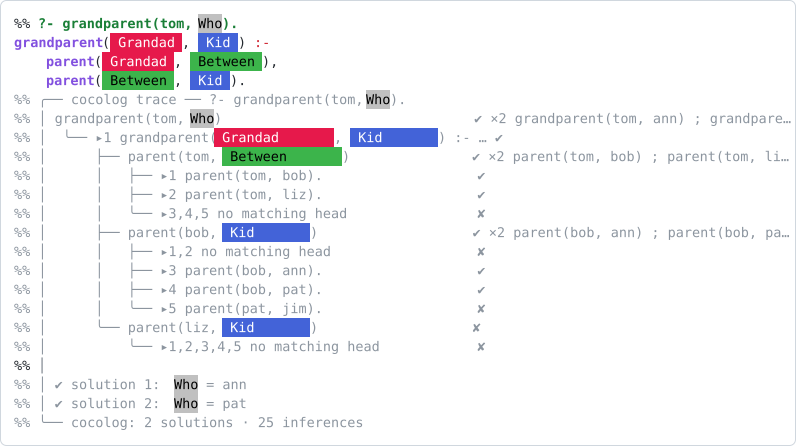
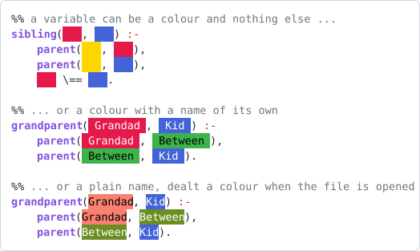
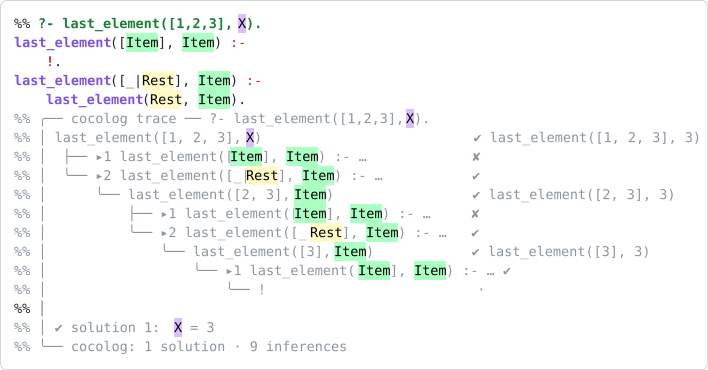
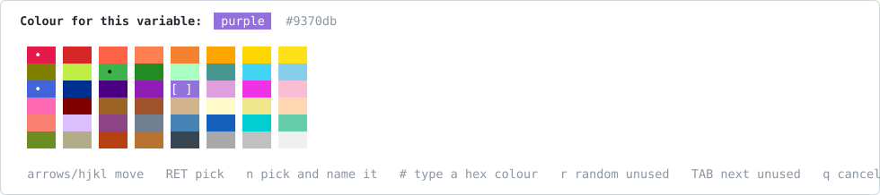
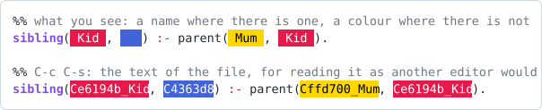
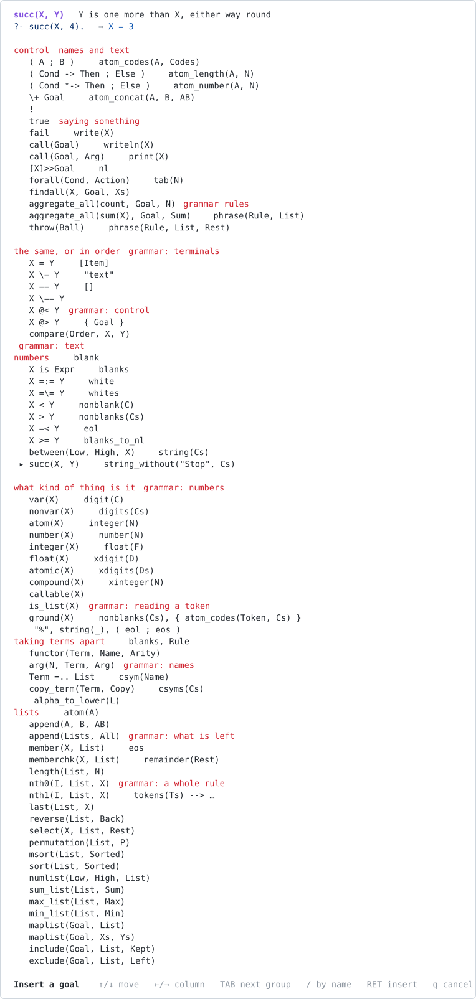
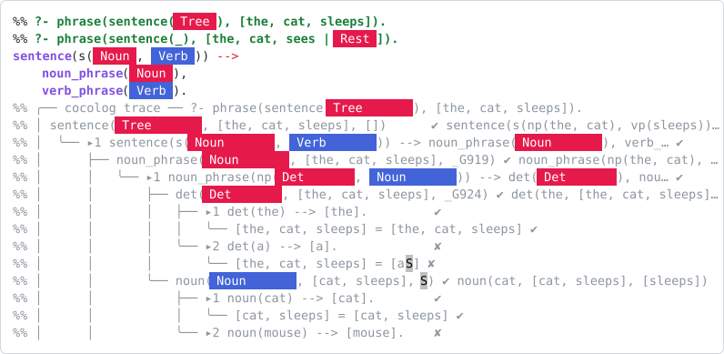
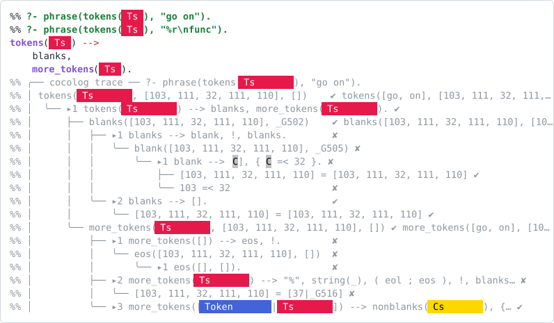

# cocolog-mode

A Prolog major mode for Emacs with two ideas of its own:

1. **Every variable has a colour.** Ordinary variables are dealt one when the
   file is opened — nothing is written down, the file stays plain Prolog. Or
   press `C-c C-v` and pick a colour from a palette to pin one into the file,
   where the colour can be the variable's name in its own right. Using the same colour
   again anywhere in the same clause means the same variable — which is exactly
   how Prolog scopes variables anyway. Such a variable shows as the colour
   alone; give it a name of your own and it shows that name on its colour, so
   two variables of a similar colour still read apart.
2. **A test case lives in a comment next to a rule.** Press `C-c C-t` and the
   mode runs it and writes the *execution graph* — the whole SLD tree, showing
   every clause tried, what unified and what failed — underneath the rule, as
   comments.

Everything stays plain text: a `.colog` file is valid Prolog, and the colours
and the graphs survive `git`, `diff` and any other editor.

<picture>
  <source media="(prefers-color-scheme: dark)" srcset="doc/graph-dark.svg">
  
</picture>

The coloured rectangles are variables, and the grey block below the rule is
what `C-c C-t` wrote. That picture is not hand made: `make doc` opens the
example file in `cocolog-mode`, lets font lock do its work and writes the
buffer out as SVG, so it cannot drift from what the mode really shows.

<details>
<summary>the same thing as the plain text that is on disk</summary>

```prolog
%% ?- grandparent(tom, Who).
grandparent(Ce6194b_Grandad, C4363d8_Kid) :-
    parent(Ce6194b_Grandad, C3cb44b_Between),
    parent(C3cb44b_Between, C4363d8_Kid).
%% ╭── cocolog trace ── ?- grandparent(tom, Who).
%% │ grandparent(tom, Who)                               ✔ ×2 grandparent(tom, ann) ; grandparent(to…
%% │  ╰── ▸1 grandparent(Ce6194b_Grandad, C4363d8_Kid) :- … ✔
%% │      ├── parent(tom, C3cb44b_Between)               ✔ ×2 parent(tom, bob) ; parent(tom, liz)
%% │      │   ├── ▸1 parent(tom, bob).                   ✔
%% │      │   ├── ▸2 parent(tom, liz).                   ✔
%% │      │   ╰── ▸3,4,5 no matching head                ✘
%% │      ├── parent(bob, C4363d8_Kid)                   ✔ ×2 parent(bob, ann) ; parent(bob, pat)
%% │      │   ├── ▸1,2 no matching head                  ✘
%% │      │   ├── ▸3 parent(bob, ann).                   ✔
%% │      │   ├── ▸4 parent(bob, pat).                   ✔
%% │      │   ╰── ▸5 parent(pat, jim).                   ✘
%% │      ╰── parent(liz, C4363d8_Kid)                   ✘
%% │          ╰── ▸1,2,3,4,5 no matching head            ✘
%% │
%% │ ✔ solution 1:  Who = ann
%% │ ✔ solution 2:  Who = pat
%% ╰── cocolog: 2 solutions · 25 inferences
```

</details>

## Install

```elisp
(add-to-list 'load-path "~/Projects/cocolog-mode")
(require 'cocolog-mode)
```

Files ending in `.colog` or `.cocolog` open in `cocolog-mode`. To use it for
`.pl` files as well:

```elisp
(add-to-list 'auto-mode-alist '("\\.pl\\'" . cocolog-mode))
```

Colouring ordinary variables — the `Grandad`/`Kid` sort, as opposed to the
colour variables written into the file — is off until you ask for it, with
`C-c C-c` for the session or this for good:

```elisp
(setq cocolog-color-plain-variables t)
```

See [Colours without writing them down](#colours-without-writing-them-down)
for what it does.

No external Prolog is needed: the engine is written in Emacs Lisp and lives in
`cocolog-engine.el`. It is a deliberate SHADOW of the real interpreter — when
a built `cocolog` binary is around, every graph the mode draws is certified
against it on the spot, and the live four-port trace refreshes beside it; see
[Tracing under the real interpreter](#tracing-under-the-real-interpreter).

Byte-compile it — `make compile` in the checkout, or `M-x byte-recompile-directory`.
Colouring the variables of a clause is font lock's work and it runs on every
keystroke; compiled it costs about a third of what it costs interpreted.

## Colours instead of names

### How it works on disk

A colour variable is an ordinary Prolog variable whose name is `C` followed by
the six hex digits of the colour, and then, if you gave the variable a name of
its own, an underscore and that name:

```prolog
sibling(Ce6194b, C4363d8) :-              %% crimson and blue
    parent(Cffd700, Ce6194b),
    parent(Cffd700, C4363d8),
    Ce6194b \== C4363d8.

grandparent(Ce6194b_Grandad, C4363d8_Kid) :-   %% crimson called Grandad
    parent(Ce6194b_Grandad, C3cb44b_Between),
    parent(C3cb44b_Between, C4363d8_Kid).
```

cocolog-mode renders those as

<picture>
  <source media="(prefers-color-scheme: dark)" srcset="doc/colours-dark.svg">
  
</picture>

That is legal Prolog — SWI, GNU Prolog and every other tool read it unchanged.
cocolog-mode only *renders* it: what you see is the variable's name on a
background of its colour, or the colour alone when it has no name. The
`Cxxxxxx` part is never shown and never edited by hand — point steps over a
variable rather than into it, and `C-c C-s` shows the file as it stands if you
need to look.

Because the colour is part of the variable name, "same colour = same variable"
needs no bookkeeping and no sidecar file, and Prolog's own clause-local scoping
means crimson in one clause has nothing to do with crimson in the next. Two
variables of the same colour but different names are, to Prolog, two different
variables — they do look alike, so `C-c C-p` and `C-c C-l` both point that out.

### Colours without writing them down

A variable with a name of its own does not need its colour in the file. Write
ordinary Prolog:

```prolog
grandparent(Grandad, Kid) :-
    parent(Grandad, Between),
    parent(Between, Kid).
```

<picture>
  <source media="(prefers-color-scheme: dark)" srcset="doc/lists-dark.svg">
  
</picture>

cocolog-mode can deal each variable a colour when it opens the buffer.
**This is off until you ask for it.** A file you open is shown as it was
written; press `C-c C-c` and the ordinary variables come out in colour, press
it again and they go back to plain text. Nothing is written to disk either
way, so the file is exactly as portable and as readable as it was.

```elisp
;; on for every cocolog buffer, from the start
(setq cocolog-color-plain-variables t)
```

in your `init.el` — or `M-x customize-variable RET cocolog-color-plain-variables`
— makes it the way the mode starts, and `C-c C-c` still switches it for the
session. Two reasons it is off to begin with: a file should look like what is
in it until you say otherwise, and this is what font lock spends its time on,
so a very large file stays quick with it off.

With it on, `C-c C-w` deals a new hand if you do not like the colours, and every
buffer gets its own, so a file looks different from one session to the next.
What is stable is what matters: two occurrences of a variable look the same,
its neighbours look *clearly* different, and a name keeps its colour across
the clauses of its predicate and through the graph written under them — a
graph names the variables of every clause, so the whole run of them shares one
set of colours. The colour a name asks for is passed
over when it would land too close to one its clause already uses, or to any
colour written into the file by hand — a dealt colour that looks like a swatch
you pinned two lines down would read as the same variable.
`cocolog-color-min-distance` says how close is too close, measured the way the
eye sees it rather than by subtracting RGB triples.

Only variables whose colour *is* their name — the bare `Cxxxxxx` ones — need
the colour in the file. `C-c C-d` rewrites any `Cxxxxxx_Name` you already have
as plain `Name` and leaves those alone; it also leaves alone a clause where two
colours share a name, since dropping the colour there would quietly turn two
variables into one.

The graph is drawn in the rule's colours too, so a variable can be followed
from the rule into the resolution; a variable only the query mentions, like the
`X` above, gets one of its own.

[examples/lists.colog](examples/lists.colog) is the picture above and contains
no colours at all; [examples/family.colog](examples/family.colog) pins them.

### Typing a name the clause already knows

A clause that says `Ce6194b_Grandad` already has a variable called Grandad in
it. Type `Grandad` again in the same clause and it becomes *that* variable —
the text is rewritten to `Ce6194b_Grandad`, and both occurrences show the same
swatch. Without that you would have two variables, identical to the eye and
different to Prolog, which is the one mistake this mode must not make. It is
clause-local, like everything else: the same name in the next clause is left
alone. `cocolog-adopt-known-variables` turns it off.

Pasted code can still contain such a pair; `C-c C-p` and `C-c C-l` both report
it — *Grandad is two variables here, one with a colour and one without*.

Renaming or recolouring a variable carries the test case beside the rule along
with it, so the query, the rule and the graph never drift apart. All of this
works the same in a grammar rule: `-->` is a clause like any other here.

### Typing

`cocolog-auto-color` goes the other way: it *writes* the colour into the file
as you type, which is what you want when a particular colour should belong to
a variable for everyone who opens the file. It is off by default now that
ordinary variables are coloured on screen anyway. With it on, an ordinary
variable is rewritten the moment you finish typing it — that is, when you type
the comma, bracket or space after it:

```
you type       p(Parent, Kid) :- q(Parent).
you get        p(Ce6194b_Parent, Cd62728_Kid) :- q(Ce6194b_Parent).
```

The name you typed is kept, so the swatch reads `Parent`. The same name later
in the same clause is the same variable and gets the same colour back — which
is the whole point: a clause ends up with one colour per variable without you
choosing anything.

Nothing else is touched. A variable that already has a colour is left alone,
prose comments and quoted strings are skipped, and a clause you have not
finished typing never rewrites the clause below it. `C-c C-r` gives a variable a different colour if you do not
like the one it drew, and `M-x cocolog-toggle-auto-color` — or the Coco menu —
turns the whole thing off:

```elisp
(setq cocolog-auto-color nil)
```

### Keys

| Key | Command | Does |
|-----|---------|------|
| `C-c C-v` | `cocolog-insert-color-variable` | open the palette, insert the chosen colour as a variable (`C-u` also asks for a name) |
| `C-c C-y` | `cocolog-insert-clause-variable` | pick by colour among the variables this clause already has — the only way to write an unnamed swatch again |
| `C-c C-n` | `cocolog-name-variable-at-point` | give the variable at point a name of its own, colour and all; an empty name gives its colour name back |
| `C-c C-r` | `cocolog-recolor-variable-at-point` | give the variable at point another colour, keeping its name, in every place it occurs in its clause; the graph below is run again |
| `C-c C-u` | `cocolog-uncolor-variable-at-point` | drop the colour and leave an ordinary variable |
| `C-c C-i` | `cocolog-insert-goal` | insert a goal, picked from one list of everything, grouped and in columns — the goals and the pieces of a grammar rule alike (`C-u` for the other half) |
| `C-c C-g` | `cocolog-insert-torch-rule` | insert a torch rule: building a net, training, a trained model — three groups, one column each |
| `C-c C-c` | `cocolog-toggle-plain-colors` | colour the ordinary variables on screen, or leave them plain |
| `C-c C-b` | `cocolog-colorize-clause` | give every variable of the clause its own colour, keeping the names they have (for code you pasted) |
| `C-c C-w` | `cocolog-shuffle-colors` | deal the ordinary variables another set of colours |
| `C-c C-d` | `cocolog-drop-stored-colors` | rewrite every `Cxxxxxx_Name` in the file as plain `Name` |
| `C-c C-p` | `cocolog-clause-legend` | echo which colour is which in this clause |
| `C-c C-s` | `cocolog-cycle-swatch-style` | show the text of the file, or hide it again |

<picture>
  <source media="(prefers-color-scheme: dark)" srcset="doc/palette-dark.svg">
  
</picture>

All of this is in the **Coco** menu in the menu bar as well, together with the
options that decide how a graph is drawn.

In the palette: arrow keys or `hjkl` to move, `RET` or `mouse-1` to pick, `n` to
pick a colour and name the variable in one go, `TAB` to jump to a colour not yet
used in this clause, `r` for a random unused one, `#` to type an arbitrary hex
colour or Emacs colour name, `q` to cancel. Colours already used in the clause
you are editing are marked with a dot, so picking one of them deliberately
reuses that variable.

To go the other way — write a variable the clause already has, rather than a
new one — `C-c C-y` opens the same grid holding *only* that clause's
variables, in the order the clause writes them, so you pick the one you mean
by its colour, the way you read it.
Plain variables are in there too, each with the colour the mode deals it. That
is the only way to write an unnamed swatch a second time: it has no name to
type, so typing cannot find it.

Backspace and `C-d` are remapped, so that a colour variable goes in one piece
rather than a character at a time. They keep everything else those keys do: a
marked region is deleted (killed, if `delete-active-region` says so), a count
means characters, `delete-selection-mode` sees them as the deletions they are,
and `backward-delete-char-untabify`, for those who bind it, still turns a tab
into spaces first. The whole variable goes only on a plain press -- with a
region or a count, the keys mean text, not variables.

### What you see, and what is on disk

The `Cxxxxxx` part is how a colour is written down; it is not something to
read, so the mode never shows it. A variable with a name of its own shows that
name on a background of its colour; one without shows its colour and nothing
else, because there the colour *is* the name. Point steps over a variable
rather than into it and `DEL` takes the whole of one, so the colour cannot be
edited by accident — `C-c C-n` renames a variable and `C-c C-r` recolours it.
`C-c C-s` shows the file as another editor would see it:

<picture>
  <source media="(prefers-color-scheme: dark)" srcset="doc/styles-dark.svg">
  
</picture>

### Themes

The text on a swatch is black or white according to the swatch's *own* colour,
never the theme's, so a variable is readable whatever you are using. The
colours the mode deals also steer clear of the frame's own background — a dark
colour on a dark theme, or a pale one on a light theme, would melt into it —
so a dealt swatch always stands on its own.

A colour you pinned yourself may still land near the background; that one gets
a thin outline (an underline on a terminal, which has no boxes), drawn in a
tint of the swatch rather than in stark black or white, so it reads as an edge
and not as a highlight. cocolog-mode redraws them when you change theme, which
also covers something like `auto-dark` switching under you.
`cocolog-swatch-outline` can be `auto` (the default), `t` for always, or nil
for never.

Hovering over a swatch names its colour. `C-c C-p` lists the variables of the
current clause with their names, hex values and occurrence counts, and says so
when one colour stands for two variables. The mode never depends on colour
perception to work — a named variable reads by its name, and the colour is a
second way of telling it apart.

## Writing the goals

`C-c C-i` opens one list of everything that can be written in a clause, laid
out in columns, under a heading for each thing it is for -- control, the same
or in order, numbers, what kind of thing is it, taking terms apart, lists,
names and text, saying something, and then, under headings of their own, the
pieces a grammar rule is made of:

<picture>
  <source media="(prefers-color-scheme: dark)" srcset="doc/goal-picker-dark.svg">
  
</picture>

Above the columns are two lines about the piece you are standing on: what it
does, and a worked example -- the query, and the answer the engine gives it.

```
 findall(X, Goal, Xs)   every X there is, gathered into a list
 ?- findall(X, member(X, [a,b]), Xs).   ⇒   Xs = [a, b]
```

They are lines of the window, not of the buffer, so they stay in sight for the
pieces at the bottom of a long list instead of scrolling away with it; the
keys sit in the mode line for the same reason. Keeping them out of the columns
is also what keeps the columns narrow enough to sit side by side.

Every piece has an example, and the examples are run by a test that compares
the answer, so one that has gone stale is a failing test rather than a wrong
line on the screen.

Arrows move: `↑`/`↓` within a column, `←`/`→` across to the next one. `TAB`
and `S-TAB` jump group to group, `mouse-1` picks, `/` types a name instead,
`RET` inserts and `q` gives up.

Which end it opens on depends on where you are: inside a rule written with
`-->` it opens on the grammar, anywhere else on the goals, and `C-u C-c C-i`
opens on the other one. Both halves are always there, one `TAB` away -- a
grammar rule is full of ordinary goals in `{...}`, and that is the reason
the two lists are one.

`C-c C-g` is a picker of its own: the torch rules a training program is
written out of, in three columns -- building a net, training, a trained
model -- ending on a whole tutorial's `train`, `test` and `predict` as one
piece. The pieces are the shapes of `tutorials/` in the cocolog repository
and run under the `cocolog` binary, which carries the torch module; the engine of
this mode traces no tensors.

The grammar groups keep a heading of their own -- `grammar: numbers`,
`grammar: text` -- because `atom(A)` in a rule writes a name out where
`atom(X)` in a goal asks whether it is one, and the two must not read as the
same line twice. A piece that is in both halves, like `phrase/2`, is kept
once. `cocolog-pick-columns` (2) says how many columns to aim for; a window
too narrow for that many gets fewer rather than pieces cut in half.

A piece with a placeholder arrives with the region over it, so
`findall(X, Goal, Xs)` can be filled in by typing straight away.

A piece can also be a whole rule. Under `grammar: a whole rule` is a working
tokenizer — words, remarks, and the white space between them — shown in the
grid by its first line and inserted in full, all four clauses of it. Its
example is run against itself by the same test that checks the others, so what
the picker writes for you is a rule that works, not a sketch of one.

The list is not decoration: a test asserts that every builtin the engine has
is on it (bar the operators, which the list writes as terms -- `X is Expr`,
`X @< Y`), and that nothing on it is a predicate the engine has never heard
of. What Prolog has and the engine does not -- assert, `catch`, real streams
-- is deliberately absent, so the list doubles as the answer to "what can I
write here?".

## Test cases and execution graphs

Write a test case as a comment directly above the rule (or directly below it):

```prolog
%% ?- ancestor(bob, Who).
ancestor(X, Z) :- parent(X, Y), ancestor(Y, Z).
```

| Key | Command | Does |
|-----|---------|------|
| `C-c C-t` | `cocolog-run-test-at-point` | run the test case of this rule, draw the graph below it |
| `C-u C-c C-t`, `C-c C-a` | `cocolog-run-all-tests` | do that for the whole buffer |
| `C-c C-k` | `cocolog-clear-trace-at-point` | remove the graph again (`C-u` for all of them) |
| `C-c C-q` | `cocolog-query` | ask a one-off query, result in a side window |
| `C-c C-e` | `cocolog-coco-trace` | run a goal over this file under the real `cocolog` binary with the four-port tracer on (`C-u` for no tracer, just the goal's output) |
| `C-c C-l` | `cocolog-check-buffer` | list syntax errors |

Details:

* The **Coco** menu has all of these, plus toggles for the graph style.
* A graph is an answer about the rule above it, so editing the rule redraws it:
  the colour and naming commands do it as they go, and ordinary typing does it
  once you stop (`cocolog-refresh-idle`, two seconds). A rule that does not
  parse yet is never run, so a half-written clause leaves its graph alone.
  A graph names the variables of every clause of its predicate, which is why
  it is run again rather than patched.
* Several `?- ...` lines in one comment block produce several graphs, in order.
* A test written above the *first* clause of a predicate also applies to its
  other clauses, so a predicate spread over many clauses needs only one test.
* Re-running replaces the previous graph instead of stacking a new one; the
  graph is only comments, so the file still parses, and `C-c C-k` removes it
  without a trace.
* The query runs against the whole buffer, so facts elsewhere in the file are
  available. Handwritten comments between the rule and the graph are preserved.
* Set `cocolog-run-tests-on-save` to `t` to refresh every graph on save.

### How to read a graph

```
│ member(9, [1, 2, 3])                                ✘        the goal, and its result
│  ├── ▸1 member(X, [X|_]).                           ✘        clause 1 was tried, head did not match
│  ╰── ▸2 member(X, [_|T]) :- …                       ✘        clause 2 matched, its body failed
│      ╰── member(9, [2, 3])                          ✘        ... which called this
│          ╰── ▸1,2 no matching head                  ✘        both clauses rejected at once
```

* `✔ goal(...)` after a goal is the goal *as it stood when it succeeded* — the
  bindings made visible. `✔ ×3` means it succeeded three times on backtracking.
* `▸N` is the Nth clause of the predicate, in source order.
* The solutions of the query and a summary line (solution count, inference
  count) close the block.

## Tracing under the real interpreter

The graphs above run on the mode's own engine. `C-c C-e`
(`cocolog-coco-trace`) runs a goal over the buffer's FILE under the real
`cocolog` binary with `--trace` on, and streams the four ports — `Call`,
`Exit`, `Redo`, `Fail`, in SWI-Prolog's format, which cocolog's own
suite holds it to port for port — into a `*coco trace*` buffer, each
port in its own colour. The goal offered is the rule at point's own
`?-` test comment, so tracing a rule is `C-c C-e RET`.

Which knowledge base the run opens is a setting, the binary's own four:
`local` (memory, the default), `embed` (the store at
`cocolog-coco-store`, `./KB`), `server` and `http`.
`M-x cocolog-set-arrangement` switches it for the session, and the
`cocolog-coco` customisation group holds the store directory, kb name,
host and ports. With `C-u` — or `M-x cocolog-coco-run`,
also on the **Under coco** menu beside the toggles for certifying and
the live trace — the tracer stays off and the buffer shows
only what the goal prints — which is how a torch tutorial's `train`
runs from the buffer it is written in: `embed` arrangement, goal
`train`, and the model lands in the store for `test` and `predict` to
load.

And the tracer is not only behind `C-c C-e`: **the engine draws, coco
certifies**. Whenever the binary is reachable, every `C-c C-t`,
`C-c C-a` and `C-c C-q` re-asks the real interpreter the same queries —
in memory, touching no store, whatever the chosen arrangement — and
compares the answers: agreement is a word in the echo area (`· cocolog
agrees`), disagreement a loud warning naming the query and both
answers. The rule's first query is also traced under `--trace` on each
run, so the `*coco trace*` buffer always holds the four ports of the
graph you are looking at. Without a binary the graphs stand on the
engine alone, as they always did — the engine is a shadow held to
cocolog twice over: offline by `make coco`, and live on every draw.
`cocolog-coco-check` and `cocolog-coco-trace-on-test` switch the two
halves off.

## Grammar rules

Rules written with `-->` work, and so does the graph:

<picture>
  <source media="(prefers-color-scheme: dark)" srcset="doc/grammar-dark.svg">
  
</picture>

A grammar rule describes a list. cocolog-mode translates it into the clause
Prolog actually resolves, with two extra arguments — the list before the rule
has read anything, and the list left over afterwards:

```prolog
greeting --> [hello], name.          %% is stored as
greeting(S0, S) :- S0 = [hello|S1], name(S1, S).
```

The graph shows both halves of that: each rule appears as you wrote it, arrow
and all, while the goals under it carry the two lists, so you can watch the
list get shorter as the parse goes on and see exactly where a rule gave up.

<picture>
  <source media="(prefers-color-scheme: dark)" srcset="doc/tokens-dark.svg">
  
</picture>

That one is the tokenizer of section 4 of
[examples/grammar.colog](examples/grammar.colog): `blanks`, `nonblanks//1`,
`string//1`, `eol` and `eos`, with the graph showing `blanks` finding nothing
to skip and `more_tokens` trying its three clauses in turn. The whole rule is
in the picker as well, under `grammar: a whole rule`.

`C-c C-i` writes the pieces for you: inside a rule written with `-->` it
opens the picker on the grammar half, where the terminals, the white space,
the numbers and the names are, each with a line about what it does. The
goals are in the same list, a `TAB` away, which is what a `{...}` needs.
See [Writing the goals](#writing-the-goals).

`phrase(Rule, List)` proves that `Rule` describes the whole of `List`, and
`phrase(Rule, List, Rest)` leaves `Rest` over — which is what a pushback rule
needs, since it always puts something back. Terminals may be lists or
strings (`"ab"` is `[97, 98]`), `{Goal}` is plain Prolog that reads nothing,
and `,` `;` `->` `\+` `!` and a pushback head (`a, [b] --> [c].`) all
translate. [examples/grammar.colog](examples/grammar.colog) has a sentence grammar that
builds a parse tree, aⁿbⁿ, a number reader, a tokenizer built out of
`library(dcg/basics)`, and a pushback rule — each with test cases and graphs,
including one query that fails, because the graph is the clearest way to see
why. The tokenizer also says what `|` and `...` do *not* mean in a grammar
body, since both look as though they ought to work.

## What the engine supports

Standard operators and syntax, including quoted atoms, `0'c`, `0x`, floats,
lists, curly terms, strings as code lists, comments, and grammar rules.

Control: `,` `;` `->` `*->` `\+` `!` `call/1..8`, yall lambdas
(`[X,Y]>>Goal`, `Free/[X]>>Goal`).

Builtins: `=` `\=` `==` `\==` `@<` `@>` `@=<` `@>=` `compare/3`, `is` and the
arithmetic comparisons, `var` `nonvar` `atom` `number` `integer` `float`
`atomic` `compound` `callable` `is_list` `ground`, `functor/3` `arg/3` `=..`
`copy_term/2`, `findall/3` `forall/2` `aggregate_all/3`, `between/3` `succ/2`
`length/2`, `msort/2` `sort/2`, `atom_codes/2` `atom_length/2` `atom_number/2`
`atom_concat/3`, `write/1` `writeln/1` `print/1` `nl/0` `tab/1`, `throw/1`,
`phrase/2` `phrase/3`.

A small library is written in Prolog itself (so it shows up in graphs).
From `library(lists)`: `append/2` `append/3` `member/2` `memberchk/2` `reverse/2` `last/2`
`nth0/3` `nth1/3` `select/3` `permutation/2` `maplist/2..4` `sum_list/2`
`max_list/2` `min_list/2` `numlist/3` `include/3` `exclude/3`.
From `library(dcg/basics)`: `eos//0` `remainder//1` `digit//1` `digits//1`
`integer//1` `number//1` `float//1` `xdigit//1` `xdigits//1` `xinteger//1`
`blank//0` `blanks//0` `white//0` `whites//0` `nonblank//1` `nonblanks//1`
`blanks_to_nl//0` `eol//0` `string//1` `string_without//2` `csym//1` `csyms//1`
`alpha_to_lower//1` `atom//1`.

Deliberately absent: assert/retract, modules, exception *catching*, I/O to
real streams, constraints.  What is there is checked against cocolog by
`make coco`. Directives (`:- ...`) are read
and ignored. Calling an undefined predicate is an error, as with
`unknown = error`.

Runaway queries are bounded. `cocolog-max-seconds` (5) is the one that
matters: counting what the engine does says nothing about how long it takes,
since a program building an ever longer term costs more with every step, so
the clock is what promises the editor comes back. Beside it,
`cocolog-max-inferences` (60000) counts steps, `cocolog-max-depth` (1000)
fails a branch that recurses deeper than any program means to,
`cocolog-max-solutions` (10) limits how many answers a test case reports,
`cocolog-max-exits` (10) how many times one goal in the graph shows what it
came back with, and `cocolog-trace-max-nodes` (500) caps the size of the
recorded graph. Each limit is reported in the graph rather than silently
applied: a branch given up on for depth is not the same thing as a query with
no answer, and the summary line says which it was. Set the depth much higher
and you reach the limit of the Lisp stack instead, which comes back as an
error.

Graphs are drawn when you ask for one — `C-c C-t` for the rule at point, `C-c
C-a` for the buffer — and at no other time. A rule being written is half a
rule, and the rules a graph helps most with are the ones that do not terminate
yet. To have the graph under the rule redrawn once you stop typing, set
`cocolog-refresh-idle` to a number of seconds (2.0 is a reasonable one), or
turn it on from the **Coco** menu under "Test cases".

## Customisation

`M-x customize-group RET cocolog RET`, or:

| Variable | Default | Meaning |
|----------|---------|---------|
| `cocolog-color-min-distance` | `250` | how far apart the colours of one clause must look |
| `cocolog-pick-columns` | `2` | how many columns `C-c C-i` lays its groups out in |
| `cocolog-torch-pick-columns` | `3` | how many columns `C-c C-g` lays the torch groups out in — one each |
| `cocolog-torch-snippets` | 3 groups | the torch rules `C-c C-g` offers, shaped like the other two tables |
| `cocolog-coco-program` | the checkout's | the `cocolog` binary `C-c C-e` runs — found beside the mode in a cocolog checkout, `cocolog` on PATH otherwise |
| `cocolog-coco-arrangement` | `local` | which knowledge base a coco run opens: `local`, `embed`, `server` or `http` — `M-x cocolog-set-arrangement` switches it |
| `cocolog-coco-store` | `./KB` | the store directory of the `embed` arrangement |
| `cocolog-coco-kb` | `main` | the knowledge base name, where one is named |
| `cocolog-coco-host`, `-port`, `-http-port` | the binary's | where the `server` and `http` arrangements connect |
| `cocolog-coco-check` | `t` | certify every drawn graph against the binary, when one is reachable |
| `cocolog-coco-trace-on-test` | `t` | refresh the `*coco trace*` ports on every test run |
| `cocolog-color-plain-variables` | `nil` | colour ordinary variables on screen, writing nothing (`C-c C-c`) — off to begin with, since it is what font lock spends its time on in a very large file |
| `cocolog-adopt-known-variables` | `t` | a name the clause already has becomes that variable |
| `cocolog-auto-color` | `nil` | colour an ordinary variable as soon as you finish typing it |
| `cocolog-swatch-code-languages` | prolog, cocolog, colog | fenced languages `cocolog-swatch-mode` colours |
| `cocolog-swatch-outline` | `auto` | outline a swatch whose colour is close to the background |
| `cocolog-swatch-style` | `name` | `name` (what the variable is called) or `raw` (the text on disk) |
| `cocolog-swatch-text` | `"   "` | what a `block` swatch is made of |
| `cocolog-palette` | 48 colours | the colours the picker offers |
| `cocolog-palette-columns` | 8 | palette grid width |
| `cocolog-indent-width` | 4 | body indentation |
| `cocolog-comment-prefix` | `"%% "` | comment prefix for generated graphs |
| `cocolog-graph-unicode` | `t` | box drawing characters, or pure ASCII |
| `cocolog-graph-show-clauses` | `t` | show which clause was tried |
| `cocolog-graph-collapse-failures` | `t` | merge runs of non-matching clauses |
| `cocolog-graph-clause-detail` | `head` | `head` or `full` clause text |
| `cocolog-graph-status-column` | 52 | where results are printed |
| `cocolog-graph-max-width` | 96 | how wide a graph line may be *in the file* — comment prefix and bar included |
| `cocolog-refresh-idle` | `nil` | seconds of quiet after which an edited rule's graph is redrawn; off, so graphs are drawn only by `C-c C-t` and `C-c C-a` |
| `cocolog-run-tests-on-save` | `nil` | refresh all graphs on save |

## Files

| File | Contents |
|------|----------|
| `cocolog-engine.el` | reader, writer, unification, solver, trace recording |
| `cocolog-graph.el` | turns a trace into the comment block |
| `cocolog-color.el` | colour arithmetic, colour variables, the palette picker |
| `cocolog-mode.el` | the major mode: font lock, indentation, commands |
| `cocolog-markdown.el` | optional: read this README in Emacs the way a browser shows it |
| `test/cocolog-tests.el` | 46 ERT tests |
| `examples/` | `family.colog`, `lists.colog` and `grammar.colog`, graphs included |
| `tools/` | `cocolog-svg.el`, which renders a fontified buffer to SVG for the pictures above, and `coco-diff.sh`, which checks the engine against cocolog |
| `doc/` | those pictures, regenerated with `make doc` |

## Reading this README inside Emacs

The pictures above are HTML `<picture>` elements and the examples are fenced
code, so in a Markdown buffer they are just tags and grey text. Two optional
pieces fix that:

* `cocolog-swatch-mode` shows every `Cxxxxxx` the way a cocolog buffer does —
  its name on a background of its colour, or the colour alone when it has none
  — in any buffer: Markdown, Org, a diff, a magit log. Set
  `cocolog-swatch-mode-style` to `raw` if you would rather see the whole
  `Cxxxxxx_Name`, which keeps the columns of a pasted graph lined up.
  Ordinary variables inside a fenced code block are coloured too, so the
  examples on this page read the way the pictures beside them were drawn --
  this mode turns that on for the buffer it is in, whatever the editing
  default is. Only blocks tagged
  with a language in `cocolog-swatch-code-languages` (`prolog`, `cocolog`,
  `colog`) count — prose, shell and elisp blocks are left alone, or the `-Q` of
  `emacs -Q` would come out looking like a variable.
* `cocolog-markdown-images-mode` displays the `` and `<picture>`
  elements inline, picking the light or the dark variant to match your theme
  and following theme changes (so it does the right thing under `auto-dark`).

`cocolog-markdown-setup` turns both on and is meant for a hook:

```elisp
(with-eval-after-load 'markdown-mode
  (setq markdown-fontify-code-blocks-natively t)
  (add-to-list 'markdown-code-lang-modes '("prolog" . cocolog-mode))
  (add-to-list 'markdown-code-lang-modes '("cocolog" . cocolog-mode)))

(with-eval-after-load 'cocolog-mode (require 'cocolog-markdown))
(add-hook 'markdown-mode-hook #'cocolog-markdown-setup)
(add-hook 'gfm-mode-hook      #'cocolog-markdown-setup)
```

The `markdown-code-lang-modes` entry is what colours the variables inside a
` ```prolog ` fence: markdown-mode fontifies the fence with `cocolog-mode`
itself. `C-c C-x C-p` toggles the pictures, and a Markdown buffer gets a small **Coco**
menu of its own for them.

## Checking the engine against cocolog

The engine is written in Emacs Lisp and is nobody's idea of a Prolog system.
A graph that says a query succeeds where the real Prolog says it fails would
be worse than no graph -- and the real Prolog this mode is written for is
**cocolog**, the interpreter at the root of this repository. The rule the
check holds is a contract with two directions: every fact and rule a user
writes must trace in this mode the way cocolog proves it, and everything the
mode itself offers -- its pickers' pieces, their examples -- must consult and
run under the `cocolog` binary:

```bash
make coco
```

It asks both every test case in `examples/`, every query in
[test/conformance-queries.txt](test/conformance-queries.txt) against
[test/conformance.pl](test/conformance.pl) — integer division and `mod` on
negative numbers, the standard order of terms, `findall`, `copy_term`, cut,
`forall`, `aggregate_all`, grammar rules with pushback and `{}`, the
`library(dcg/basics)` grammar pieces, the tokenizer of
[examples/grammar.colog](examples/grammar.colog) over eight inputs — remarks,
empty input, tabs and newlines — and an unknown predicate — and then every
example the snippet pickers show, each consulted with the rule it brings
along. Answers are compared after normalising the two writers' spacing and
their different names for unbound variables:

```
234 queries, 234 agree, 0 differ
```

It needs the `cocolog` binary from the repository root (`make` up there
builds it; `COCOLOG=/path/to/cocolog` points elsewhere) and says so rather
than passing quietly when it is missing.

Two seams needed bridging, and the bridge is in
[tools/coco-diff.sh](tools/coco-diff.sh) rather than in either system. The
engine resolves a program's own rules before its library's, the way a
module's definition shadows an import; cocolog consults into one namespace.
So every question is asked with cocolog's own vendored `dcg/basics` and
`yall` consulted first -- minus, to a fixpoint, every library clause for a
predicate the program defines itself. And the engine's library carries a few
rules SWI's `dcg/basics` lacks -- the `csym//1` family --
which travel in [tools/coco-prelude.pl](tools/coco-prelude.pl), copied
verbatim from `cocolog-library-source`, so cocolog is asked the same rules
the engine runs.

### Which libraries

The engine was first held to SWI-Prolog 10.0.2, and cocolog's own suite
holds cocolog to SWI in turn -- so the three agree by construction, and
`make coco` is what checks the two ends of this repository against each
other directly.

Two of those libraries need no `use_module` here, written in Prolog inside
[cocolog-engine.el](cocolog-engine.el) so that they appear in graphs like any
other rule:

| Library | cocolog has | cocolog does not have |
|---------|-------------|-----------------------|
| `library(lists)` | `append/2` `append/3` `member/2` `memberchk/2` `reverse/2` `last/2` `nth0/3` `nth1/3` `select/3` `permutation/2` `maplist/2..4` `sum_list/2` `max_list/2` `min_list/2` `numlist/3` `include/3` `exclude/3` | `subtract/3` `intersection/3` `union/3` `list_to_set/2` `sumlist/2` `foldl/4..6` `pairs_keys_values/3` |
| `library(dcg/basics)` | `eos//0` `remainder//1` `digit//1` `digits//1` `integer//1` `number//1` `float//1` `xdigit//1` `xdigits//1` `xinteger//1` `blank//0` `blanks//0` `white//0` `whites//0` `nonblank//1` `nonblanks//1` `blanks_to_nl//0` `eol//0` `string//1` `string_without//2` `csym//1` `alpha_to_lower//1` `atom//1` | `prolog_var_name//1`; `xinteger//1` and `atom//1` only *write* ground terms of the kinds `atom_codes/2` handles |

`csyms//1` is in cocolog and not in SWI's export list, though SWI's source has
it -- the picker offers it because a run of name characters is a useful thing
to ask for.

Where the two are made to differ on purpose: `csym(Name)` with `Name` already
bound writes the name out and stops, where SWI's leaves a choice point that
runs the stack out; and `append/2` with an unbound first argument enumerates
here, where SWI raises an instantiation error, since there is no `must_be/2`. Everything else is a bug, and
[test/conformance-queries.txt](test/conformance-queries.txt) is where it gets
caught -- `csym//1` used to read a single character here, which is what
`csyms//1` does, and it was the conformance run that said so.

### Why not use the real libraries?

Because there is nothing to use them *from*. The engine is Emacs Lisp: it
loads a `.colog` buffer, resolves it, and draws the graph, all inside Emacs and
all without a Prolog installed. `use_module(library(dcg/basics))` needs a
Prolog system to load it into; there isn't one. Reading a test case has to work
on a laptop with nothing else on it, the way font lock does.

The honest alternative would be to *read the vendored* `basics.pl` and
consult it into the engine. That was tried in the head and not
on disk: it needs `code_type/2`, `number_codes/2`, `must_be/2`,
`format(codes(H,T), ...)`, `succ_or_zero`-style internals and the module
system, so a handful of grammar rules would have dragged in most of a Prolog
system; and
the rules would arrive as a file the graph cannot show as you wrote it.

So they are re-implemented -- about sixty lines of Prolog -- and then the
copies are held to the originals: `make coco` asks both the same
questions and refuses to pass when the answers differ. A re-implementation
that nobody checks is a guess, and this one is checked on every run.

## Tests

```bash
make test
```

or

```bash
emacs -Q --batch -L . -L test -l test/cocolog-tests.el -f ert-run-tests-batch-and-exit
```

And to redraw the pictures in this file from the example buffers:

```bash
make doc
```
