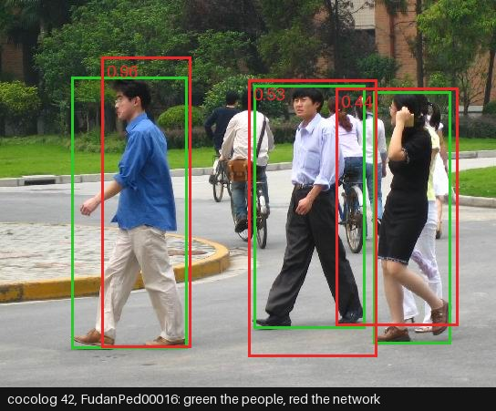
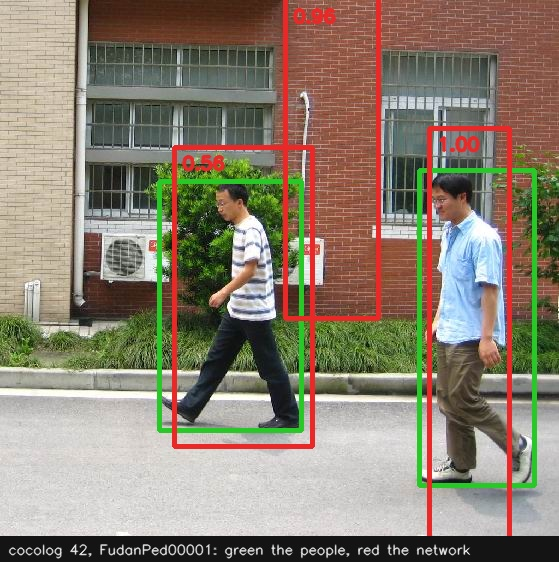
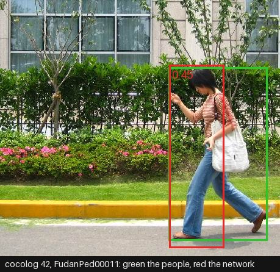

# Tensor: forty-two networks, one file each

*One of four tutorial categories — `../basics/` is the language,
`../library/` is what ships, and this is the deep end.*

Every file here is written in `library(tensor_expr)`, which is THE way to
write machine learning in cocolog: a network is an expression,
`relu(X matmul W1 + B1) matmul W2 + B2`; a loss is a defined function,
`loss(X, Y, W, B) ::= mean((X matmul W + B - Y) ^ 2.0)`; a forward pass,
a cell, a data generator and the three goals are PROCEDURES, DCG rules
of bindings `V = E` run by `exec/1`, which frees what they made; the
loop that steps an optimiser is a predicate in braces, `sgd_step/4` or
`adam_step/6`, and the parameters it steps are made there too; and a
trained model is its parameter list, saved by `params_save/2` as terms
in the knowledge base and read back by `params(Name)` in any later
process, on any library. The directory is `tensor/` and not `torch/`
because the predicates under the grammar have two libraries behind them,
`tensor_execution(torch | tensorflow, eager | graph, cpu | cuda | auto)`,
and every file runs on either: the backend is a switch set from outside,
the file does not name it, and `seed/1` seeds whichever is selected.

    ./cocolog --embed /tmp/tutorials run tutorials/tensor/32-resnet.pl "tensor_execution(tensorflow, graph), train"

is the same file on TensorFlow, with `library(tensorflow)` built -- the
pip `tensorflow` on Linux, Homebrew's `libtensorflow` on macOS. Three
things that follow, each run: a model trained under `graph` on a GPU
predicts under `eager` on a CPU, because the store holds shapes and
numbers and `params(Name)` rebuilds them wherever it is loaded (the
device is the third argument of `tensor_execution/3`, not the mode);
`eager` against `graph` is about WHEN a goal computes, not WHERE --
either mode runs on either device, and graph, one compiled call a step,
is the one that keeps the CPU freest; and a model trained on TensorFlow
tests on torch from the same store, and the reverse, as 31 and 32 were
run both ways -- within float tolerance and from different random draws.

Every file carries its own documentation and three goals, each meant to
run as its OWN process against the same store, because the trained model
lives in the knowledge base as terms, not in memory:

    ./cocolog --embed /tmp/tutorials run tutorials/tensor/01-linear-regression.pl train
    ./cocolog --embed /tmp/tutorials run tutorials/tensor/01-linear-regression.pl test
    ./cocolog --embed /tmp/tutorials run tutorials/tensor/01-linear-regression.pl predict

`train` builds the data, fits the network, and saves its parameters;
`test` loads them back and judges them against a threshold, exiting
nonzero on failure; `predict` loads them and answers for a few visible
inputs beside the truth. Data is generated in-file and deterministic
(a fixed `seed/1` and a sin-hash noise), so nothing is downloaded and
every run agrees with the last. The `model_*` API of `library(torch)` --
libtorch's own layers, trained inside its C++ -- is still there, and
library lesson `../library/22-torch.pl` teaches it; these files no longer
use it, so that each is one program on both libraries.

| file | teaches |
|---|---|
| 01-linear-regression | one expression, mse, `grad` and `sgd_step` |
| 02-multi-feature-regression | a held-out split as an answer form, Adam |
| 03-polynomial-features | feature engineering against capacity: a linear expression fits a cubic |
| 04-sine-approximation | a tanh hidden layer as a defined function, universal approximation |
| 05-relu-approximation | relu hinges, depth, a network over its parameter list |
| 06-logistic-regression | a sigmoid probability, `bce`, accuracy counted by hand |
| 07-xor | the hidden layer xor needs, as two expressions under `cross_entropy` with `one_hot` |
| 08-two-moons | one relu layer carving a curved boundary |
| 09-four-blobs | multiclass at its plainest: a four-logit head, `one_hot`, `cross_entropy`, `accuracy` |
| 10-spiral | depth, and BARE logits under `cross_entropy` -- the composite holds the log_softmax |
| 11-dropout | dropout as a MASK expression with inverted scaling, and train against eval as two `::=` clauses, two eval passes bit-identical |
| 12-lr-schedule | a schedule is a Prolog predicate handed to `sgd_step`; minibatches as `rows` slices made once |
| 13-robust-mae | the same line fitted by two defined functions, mse and mae: outliers lift the mse fit by their share and the mae fit not at all |
| 14-autoencoder | the 8-3-8 bottleneck as two procedures, encode and decode, the input its own target |
| 15-denoising | noisy in, clean out: the whole difference from 14 is `mse(Out, Y)` for `mse(Out, X)` |
| 16-multi-output | two targets in one head, a [2, 2] weight; mse averages over both columns |
| 17-cnn-bars | a 3x3 convolution as nine shifted matmuls in a pixels-as-rows layout (`conv2d`, `shifts`), `pool2`, `reshape` as the flatten |
| 18-mini-lenet | two conv stages, the shape flowing down the rule, LeNet's 32 features by arithmetic read off each line |
| 19-batch-norm | batch norm as an expression over the batch; parameters against buffers -- the running statistics moved by `step`, saved in the same list |
| 20-save-load | what `params_save` leaves in the knowledge base, `params(Name)` reading it back to the last bit, and a reloaded list training further |
| 21-lstm-sum | sequence input, recurrent accumulation: an LSTM cell as a procedure, four gates written out, the sequence a recursion over timesteps threading its states |
| 22-embedding-lstm | token ids, embeddings, memory: `index_rows` on a parameter matrix as the lookup, `cross_entropy` on the last hidden state's logits |
| 23-stacked-lstm | recurrent depth, weights through the store: two cells feeding at every step, 27 parameters saved, loaded twice and identical within 1e-6 |
| 24-q-learning | reinforcement learning: fitted Q-iteration on a gridworld, the Q-network a defined function, Bellman targets in Prolog, the greedy policy through `argmax` |
| 25-char-lm | a character-level language model of cocolog itself, as expressions: the embedding by `index_rows`, the LSTM cell a procedure through one defined gate function, the recurrence a rule over sixteen positions, judged against always-space and bigram baselines rather than chance |
| 26-char-transformer | the same model with one decoder block in place of the LSTM: a batch of windows as ONE score matrix under `causal_mask`, four heads through `cols` and `cat`, `layer_norm`, `gelu` -- and what that does and does not buy on four thousand characters, where it loses to lesson 25 |
| 27-induction | five networks from one interpreted specification -- lstm cells and attention layers as expressions -- a loss at every position under `causal_mask`, and where attention wins: the two-layer model finds the induction circuit in a phase change while a recurrent state creeps |
| 28-source-lm | tutorial 35's decoder one size up, trained on cocolog's own source: the corpus is ONE index tensor and a batch two `index_rows` gathers from it; sampling by temperature in predict; `heavy/1` trains on all five groups of the source, one stream tensor per file inside `free_list/2` scopes -- a GPU workload, which shrinks its cap when the device answers cpu |
| 29-sgd-by-hand | SGD written out as expressions: the loss a `::=` function, the gradient an answer, the step a procedure, the loop a predicate that frees the old pair each round; `heavy/3` is its GPU workload, scaled down where there is no CUDA device |
| 30-two-paths | one program, two execution paths on a CUDA device, on data too large to print: the same expressions eager on the CPU and graph on the device, agreeing to a tolerance, the device named once through `tensor_execution(Backend, Mode, cuda)` -- A GPU TUTORIAL: without one it says so, once, and exits 0 |
| 31-tensor-expressions | tutorial 30 again, in the syntax the predicates were asking for: `loss(X, Y, W, B) ::= mean((X matmul W + B - Y) ^ 2.0)` a defined function, the step a PROCEDURE -- a DCG rule of bindings `V = E`, run by `exec/1`, which frees what it made -- and `expr//2` behind it all, the same list of goals under both paths; on six rows |
| 32-resnet | residual blocks as expressions: `relu(H + conv(relu(conv(H))))`, a stem, two blocks, a pool, global average pooling; three shapes in noisy 8x8 pictures; conv2d/3 is nine shifted matmuls in a pixels-as-rows layout |
| 33-unet | down, across, and up with the skip: two levels, `cat/2` joining the upsampled features to the encoder's, a sigmoid per pixel, `bce/2`; a rectangle masked out of noise, judged by IoU |
| 34-transformer-encoder | one encoder block in the open: embeddings, pre-norm multi-head attention through `cols/3` and `cat/2`, the feed-forward, mean pooling; a batch of sequences as ONE score matrix under `block_mask/3`; does a token repeat |
| 35-gpt | the same block under `causal_mask/3` with a head at every position: a character model of a small text, and `predict` continues a prompt greedily, its own output fed back |
| 36-vae | the reparameterisation trick as one expression, `Mu + exp(LogVar * 0.5) * randn(S)`; reconstruction plus KL; a 3x3 walk over the two-dimensional latent plane, decoded and drawn |
| 37-gan | two networks and a loss each, the generator's gradient flowing THROUGH the discriminator; a ring of points; Adam at beta1 0.5 is the one setting that keeps the generator from collapsing onto an arc |
| 38-gcn | a graph convolution is one matmul more than a dense layer, `A X W` with A the normalised adjacency; Zachary's karate club, two labelled members, thirty-two placed by the graph alone |
| 39-realnvp | four affine coupling layers, run forwards for the likelihood and backwards for a sample; two moons; the NLL held against a fitted Gaussian's, and a density stated for a point |
| 40-ddpm | the forward process as a schedule, the network learning the noise, sampling as fifty steps back; the same ring as 37, drawn at three moments of the sampling |
| 41-seq2seq-attention | an encoder GRU, a decoder GRU, and additive attention between them, the GRU cell four expressions; sequences reversed, teacher forcing, the decoder feeding itself at test, and the attention weights printed |
| 42-object-detection | THE FIRST ONE ON REAL DATA, AND A GPU ONLY: the Penn-Fudan pedestrians, 170 photographs a `download` goal fetches and converts through `library(opencv)`, the boxes read off the instance masks in Prolog; a one-stage detector -- four convolutions by gather, since a real picture is too big for a shift matrix, a 12 by 12 grid, five numbers a cell -- with the boxes-to-cells assignment, the decoding, non-maximum suppression and the matching by overlap all in Prolog; `test` is precision and recall on the 34 held out, and `predict` runs twelve of them on torch and then on TensorFlow and compares the boxes |

**42 is the one on real data, and it looks like this.** The Penn-Fudan
photographs, held out from training, with the people in green and what
the network found in red, as `predict` draws them on the T4 with
`library(opencv)` -- the
model is a small convolutional network trained from nothing in under two
minutes, and on the 34 held-out photographs it finds 44 of every hundred
people and is right 70 times in a hundred when it speaks. The same
parameters, loaded on torch and on TensorFlow, gave the same boxes on
all twelve photographs `predict` shows:

One cocolog property every file here respects: `run` CONSULTS the file
into the knowledge base, and the knowledge base is the store -- so the
second goal's process consults the same clauses AGAIN. Consulting used
to append, and a predicate defined once in the file existed twice in the
second process: for the goals that only meant a duplicate solution nobody
asked for; for a data generator inside a findall it doubled the rows --
or, with a nondeterministic helper inside an inner findall, WIDENED them.
A consult REPLACES the file's own clauses now (`test/reconsult.pl`: the
same file twice is one copy, what the program asserted stays, an edited
file is the new file), so the store holds the program once; the
single-clause data helpers still end in a cut, because a deterministic
helper is deterministic under either rule and a store written before the
change still holds what it held. Two tutorials sharing a store would
still shadow each other's train/test/predict, so the runner gives each
tutorial a store of its own.

`test/tutorials.pl` runs all three goals of every file against a
throwaway store per tutorial; `test/torch-nets.pl` is twenty-three of these networks
as one fast in-process suite. The module itself is documented in
`modules/torch/README.md`.
